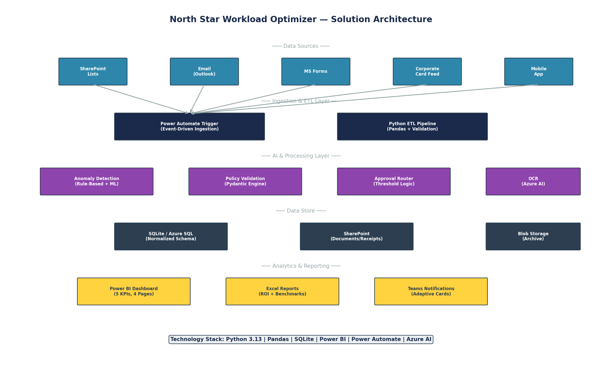

# 🌟 North Star Workload Optimizer

> **Digital Transformation for Enterprise Expense Management**
> 
> End-to-end consulting project demonstrating process reengineering, data engineering, business intelligence, and automation — reducing expense processing cycle time by **78%** and saving **$434K annually**.


---

## 📋 Problem Statement

A mid-sized professional services firm processes **420 expense reports/month** through a **12-step manual workflow** spanning 4 organizational layers. The current process suffers from:

| Metric | Current State | Target | Improvement |
|--------|:---:|:---:|:---:|
| End-to-end cycle time | 9.7 days | 2.1 days | **78% faster** |
| Annual operating cost | $620,647 | $186,194 | **70% reduction** |
| Data entry error rate | 18% | 5% | **72% fewer errors** |
| Reports per FTE/day | 8 | 25 | **3.1x increase** |

## 🏗️ Solution Architecture

The North Star Workload Optimizer is a 5-layer solution:

1. **Data Sources** — SharePoint, Email, Forms, Corporate Card feeds
2. **ETL Layer** — Python + Pandas pipeline with validation & cleaning
3. **AI/Processing** — Anomaly detection, policy validation, approval routing
4. **Data Store** — SQLite (dev) / Azure SQL (production)
5. **Analytics** — Power BI dashboard with 5 KPIs, 4 pages



## 🔑 Key Results

- **5,000** expense records generated & analyzed across 18 months
- **664** anomalies detected (13.3% anomaly rate) via rule-based engine
- **5** SQL window function queries for pattern analysis
- **10-slide** ROI deck with data-driven metrics
- **78%** cycle time reduction demonstrated

## 📁 Repository Structure

```
northstar-workload-optimizer/
├── README.md                    ← You are here
├── requirements.txt             ← Python dependencies
├── data/
│   ├── generate_data.py         ← Creates 5,000 mock expense rows
│   ├── expenses.csv             ← Generated dataset (CSV)
│   ├── expenses.json            ← Generated dataset (JSON)
│   ├── employees.csv            ← Employee master data
│   └── northstar.db             ← SQLite database
├── etl/
│   ├── etl_pipeline.py          ← Extract, Transform, Load pipeline
│   └── analysis_queries.sql     ← 5 SQL Window Function queries
├── notebooks/
│   └── EDA.ipynb                ← Exploratory Data Analysis
├── dashboard/
│   ├── dax_measures.md          ← All DAX formulas + explanations
│   ├── powerbi_guide.md         ← Step-by-step build guide
│   └── screenshots/             ← Dashboard PNG exports
├── automation/
│   ├── automation_flow.py       ← Power Automate mock pipeline
│   ├── flow_design.md           ← Maps Python → Power Automate
│   └── demo_results.json        ← Sample pipeline output
├── diagrams/
│   ├── as_is_process_flow.png   ← Current workflow (12 steps)
│   ├── to_be_process_flow.png   ← Automated workflow (5 steps)
│   ├── architecture_diagram.png ← Solution architecture
│   └── generate_diagrams.py     ← Regenerate all diagrams
├── proposal/
│   ├── ROI_deck.pptx            ← 10-slide consulting deck
│   ├── roi_calculation.xlsx     ← ROI model with formulas
│   ├── bottleneck_table.xlsx    ← Time-motion analysis
│   ├── problem_statement.pdf    ← 1-page problem statement
│   └── architecture_diagram.png ← Solution overview
└── docs/
    └── process_mapping.md       ← Detailed AS-IS documentation
```

## 🚀 Quick Start

### Prerequisites
- Python 3.10+
- Power BI Desktop (free) — for dashboard only

### Setup & Run

```bash
# 1. Clone the repository
git clone https://github.com/YOUR_USERNAME/northstar-workload-optimizer.git
cd northstar-workload-optimizer

# 2. Install dependencies
pip install -r requirements.txt

# 3. Generate mock data (5,000 records)
python data/generate_data.py

# 4. Run ETL pipeline (clean → validate → load to SQLite)
python etl/etl_pipeline.py

# 5. Run automation demo (5 sample expenses)
python automation/automation_flow.py

# 6. Generate diagrams
python diagrams/generate_diagrams.py
```

## 🔧 Technical Deep Dive

### Phase 1: Process Mapping & Discovery
- Mapped 12-step AS-IS workflow with swim lanes
- Identified 3 critical bottlenecks via time-motion study
- Quantified $620K annual cost baseline

### Phase 2: Data Engineering (Python ETL)
- **generate_data.py** — Faker + NumPy with log-normal distributions, 5% anomaly injection
- **etl_pipeline.py** — Validation → Cleaning → Feature Engineering → Deduplication → SQLite load
- **analysis_queries.sql** — Window functions: `SUM() OVER`, `RANK()`, `LAG()`, `AVG() ROWS BETWEEN`, `PERCENT_RANK()`

### Phase 3: Power BI Dashboard
- 5 KPI cards (Total Expenses YTD, Avg Approval Lag, Anomaly Rate, Policy Compliance, MoM Growth)
- 4 dashboard pages: Executive Summary, Department Deep Dive, Anomaly Detection, Approval Pipeline
- 7 DAX measures with conditional formatting

### Phase 4: Automation (Power Automate Mock)
- Pydantic-validated expense submission model
- 5-rule anomaly detection engine (z-score, weekend, round amounts, missing receipt, duplicates)
- Tiered approval routing ($500 → Manager, $2K → Director, $5K+ → VP)
- Teams/Outlook notification payload generator

### Phase 5: ROI & Consulting Deliverables
- 10-slide executive deck with embedded diagrams
- Excel ROI model with formulas (not hardcoded) + 3 scenarios
- $434K savings | 865% ROI | 1.2-month payback

## 💼 Skills Demonstrated

| Skill Area | Technologies |
|---|---|
| **Digital Strategy & Discovery** | Process mapping, bottleneck analysis, benchmarking |
| **Process Reengineering** | AS-IS/TO-BE flows, swim lanes, time-motion study |
| **Data Engineering** | Python, Pandas, NumPy, SQLite, ETL pipelines |
| **SQL Analytics** | Window functions (RANK, LAG, LEAD, running totals) |
| **Business Intelligence** | Power BI, DAX, Power Query M, KPI dashboards |
| **Automation** | Power Automate design, Pydantic validation, JSON APIs |
| **Consulting Delivery** | ROI analysis, risk registers, implementation roadmaps |

## 📄 License

This project is licensed under the MIT License.

---

*Built as a portfolio project demonstrating Technology Strategy & Transformation capabilities.*
