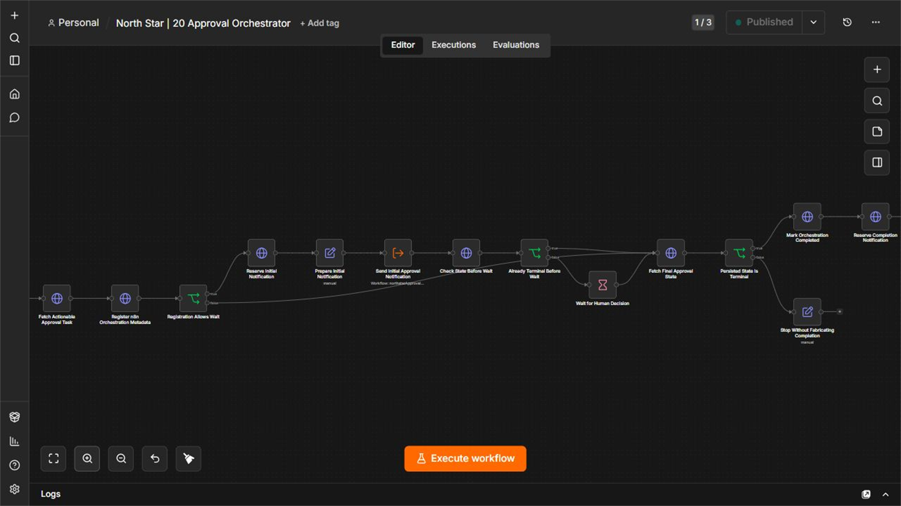

# North Star — Governed Expense Operations Platform

> **A governance-first expense automation reference implementation demonstrating deterministic policy enforcement, durable n8n orchestration, human-in-the-loop approvals, immutable decision provenance, and a full React operations dashboard.**

[](https://github.com/tusharg007/northstar-workload-optimizer/actions/workflows/ci.yml)


[](LICENSE)

---

## Table of Contents

- [What This Is](#what-this-is)
- [Architecture](#architecture)
- [System in Action](#system-in-action)
- [Tech Stack](#tech-stack)
- [Project Structure](#project-structure)
- [Quick Start](#quick-start)
- [Services & Ports](#services--ports)
- [Frontend Pages](#frontend-pages)
- [n8n Workflows](#n8n-workflows)
- [API Reference](#api-reference)
- [Demo Flow](#demo-flow)
- [Development](#development)
- [Verification](#verification)
- [Environment Variables](#environment-variables)
- [Design Principles](#design-principles)
- [Scope and Security](#scope-and-security)

---

## What This Is

North Star is a full-stack expense approval automation reference system built to demonstrate:

- **Deterministic policy enforcement** — FastAPI owns all validation, risk scoring, and routing. No LLM decides financial outcomes.
- **Durable workflow orchestration** — n8n manages multi-step approval workflows with real `Wait` nodes (not polling loops).
- **Human-in-the-loop approvals** — Escalated expenses wait indefinitely until a human approves or rejects via the UI.
- **Immutable provenance** — Every automated decision is cryptographically hashed and independently verifiable.
- **Governed context** — Expense decisions reference versioned, certified policy documents and business terms.
- **Full React UI** — Operations dashboard turns a 15-terminal-command system into a 1-command, click-driven demo.

---

## Architecture

```
┌──────────────────────────────────────────────────────────────┐
│                    React Frontend (nginx)                      │
│              http://localhost:5173                             │
│  Dashboard · Submit · Approvals · Detail · Context · Health   │
└─────────────────┬──────────────────────┬─────────────────────┘
                  │ /api/*               │ /webhook/*
                  ▼                      ▼
┌─────────────────────┐    ┌──────────────────────────────────┐
│   FastAPI (Python)  │◄───│         n8n Workflows             │
│   localhost:8000    │    │         localhost:5679            │
│                     │    │                                  │
│ • Validation        │    │  01 Expense Intake               │
│ • Risk scoring      │    │  02 Approval Decision            │
│ • Policy engine     │    │  10 Process Expense Service      │
│ • Provenance        │    │  20 Approval Orchestrator (WAIT) │
│ • Context registry  │    │  23 Reliability Dispatcher       │
│ • HITL decisions    │    │  + 5 supporting workflows        │
└─────────┬───────────┘    └──────────────────────────────────┘
          │
          ▼
┌─────────────────────┐    ┌──────────────────────────────────┐
│    PostgreSQL        │    │          Metabase                │
│    localhost:55432   │    │          localhost:3000          │
│                      │    │                                  │
│ • northstar (app)    │    │  36 questions, 5 dashboards      │
│ • n8n_app           │    │  read-only observability views   │
│ • metabase_app      │    └──────────────────────────────────┘
└─────────────────────┘
```

### Data Flow for an Expense

```
User submits via UI
      ↓
POST /webhook/northstar-expense   (n8n Workflow 01)
      ↓
Normalize → Build Context → Call FastAPI policy engine
      ↓
FastAPI validates + scores risk + determines routing
      ↓
If AUTO_APPROVED → persist + notify → respond
If ESCALATED/PENDING → n8n Workflow 20 starts, reaches WAIT node
      ↓
Expense appears in UI Approvals inbox
      ↓
Human clicks Approve/Reject → POST /webhook/northstar-approval
      ↓
n8n Workflow 02 records decision → resumes SAME Workflow 20 execution
      ↓
Workflow 20 continues → marks completed → sends notification
      ↓
Dashboard row updates to APPROVED, provenance hash verifiable
```

---

## System in Action

| Governed context and service health | Decision trace and risk evidence |
|---|---|
|  |  |

| Reliability dispatcher | Durable approval orchestration |
|---|---|
|  |  |

---

## Tech Stack

| Layer | Technology |
|---|---|
| **Frontend** | React 18, TypeScript, Vite 6, Tailwind CSS 3, Lucide React, React Router 6 |
| **API** | FastAPI (Python 3.13), Pydantic v2, Uvicorn |
| **Orchestration** | n8n 2.22.6 (self-hosted, 10 workflows) |
| **Database** | PostgreSQL 16, Alembic migrations |
| **Analytics** | Metabase (36 questions, 5 dashboards) |
| **MCP Interface** | Official Python MCP SDK 2.0; 12 tools, 5 resources, and 1 prompt; governed reads and n8n-routed writes |
| **Container** | Docker + Docker Compose, nginx reverse proxy |
| **Policy Engine** | Deterministic Python rules engine (automation/) |

---

## Project Structure

```
northstar-workload-optimizer/
├── app/                        # FastAPI application
│   ├── main.py                 # App factory, all routes
│   ├── runtime_store.py        # Runtime persistence boundary
│   ├── reliability.py          # Outbox, retry, and dead-letter behavior
│   ├── context/                # Governed context registry
│   ├── provenance/             # Immutable decision provenance
│   └── db/repositories/        # PostgreSQL repository implementations
│
├── automation/                 # Deterministic policy engine
│   ├── automation_flow.py      # Main processing pipeline
│   ├── policy_manifest.py      # Policy definitions
│   └── flow_design.md          # Policy-flow design notes
│
├── frontend/                   # React operations dashboard
│   ├── src/
│   │   ├── pages/              # Dashboard, Submit, Approvals, Detail, Context, Health
│   │   ├── layouts/            # DashboardLayout with sidebar
│   │   ├── lib/                # api.ts (typed client), utils.ts
│   │   └── types.ts            # TypeScript types matching FastAPI schemas
│   ├── Dockerfile              # Multi-stage: node build → nginx serve
│   └── nginx.conf              # Reverse proxy + SPA fallback
│
├── n8n/workflows/              # 10 portable workflow definitions
│   ├── 01_expense_intake.json
│   ├── 02_approval_decision.json
│   ├── 10_process_expense_service.json
│   ├── 20_approval_orchestrator.json
│   ├── 23_reliability_dispatcher.json
│   └── ...
│
├── mcp_server/                 # MCP interface adapter
├── metabase/                   # Observability dashboard bootstrap
├── observability/              # SQL views for Metabase
├── alembic/                    # Forward-only DB migrations
├── evals/                      # Immutable eval datasets and runner
├── tests/                      # Full test suite (122 pass)
├── scripts/
│   └── stack.ps1               # One-command stack management
├── infra/docker/               # Dockerfiles and bootstrap scripts
├── docker-compose.yml          # Full stack definition
├── .env                        # Local secrets (not committed)
└── .env.example                # Template for setup
```

---

## Quick Start

### Prerequisites
- Docker Desktop (Windows, WSL2 backend)
- PowerShell 7+
- Git

### 1. Clone and configure

```powershell
git clone https://github.com/tusharg007/northstar-workload-optimizer
cd northstar-workload-optimizer

# Copy the env template
Copy-Item .env.example .env
# Replace every change-me value with disposable local credentials
```

### 2. Launch everything

```powershell
.\scripts\stack.ps1 up
```

This single command:
- Builds the FastAPI app image
- Builds the React frontend (Vite production build inside Docker)
- Runs Alembic migrations
- Seeds governed context (policies, business terms, trust signals)
- Creates Metabase read-only role
- Imports and publishes all 10 n8n workflows
- Starts PostgreSQL, FastAPI, n8n, Metabase, nginx frontend

### 3. Open the dashboard

```
http://localhost:5173
```

### 4. Verify the stack

```powershell
.\scripts\stack.ps1 verify

# Also verify the nginx proxy is routing correctly:
Invoke-RestMethod http://localhost:5173/health
Invoke-RestMethod http://localhost:5173/api/expenses
Invoke-RestMethod http://localhost:5173/api/context/policies
```

---

## Services & Ports

| Service | URL | Description |
|---|---|---|
| **Frontend** | http://localhost:5173 | React dashboard (nginx) |
| **FastAPI** | http://localhost:8000 | REST API + Swagger docs |
| **FastAPI Docs** | http://localhost:8000/docs | Interactive API explorer |
| **n8n** | http://localhost:5679 | Workflow orchestration UI |
| **Metabase** | http://localhost:3000 | Analytics dashboards |
| **PostgreSQL** | localhost:55432 | Direct DB access |

### Local Credentials

No usable password is committed. Copy `.env.example` to `.env`, replace every
`change-me` value, and keep `.env` local. The template supplies local usernames
and loopback ports; n8n owner credentials are created during first-time setup.

---

## Frontend Pages

### 🏠 Dashboard (`/`)
- Live metrics: Total, Auto-Approved, Pending Review, Escalated, Approved
- Filterable expense table with status and risk badges
- Auto-refreshes every 5 seconds
- Click any row to open full expense detail

### 📋 Submit Expense (`/submit`)
- 4 one-click demo presets (see Demo Flow below)
- Full expense form with all fields
- Instant result panel showing status, risk level, anomaly flags, routing reason
- Submission goes through **n8n Workflow 01** (not direct to FastAPI)

### ✅ Approvals (`/approvals`)
- HITL inbox showing all PENDING_APPROVAL + ESCALATED expenses
- Expandable review cards with expense details
- Approve/Reject with approver name and comment
- Decision goes through **n8n Workflow 02** → resumes **Workflow 20**

### 🔍 Expense Detail (`/expenses/:id`)
Three tabs:
- **Overview** — payload details, risk bar, anomaly flags, routing decision, provenance summary
- **Lineage** — visual timeline of all workflow events
- **Provenance** — evidence counts (policies, terms, rules, trust, risk), hash display, **Verify Integrity** button

### 📚 Governed Context (`/context`)
- Browse all certified policies with expandable version history and rule parameters
- Browse all business terms with definitions and version history
- Shows owner, domain, certification status for each

### 🩺 System Health (`/health`)
- FastAPI health status
- Dead Letter Queue events table
- Workflow failures monitor
- Quick links to API docs, n8n, Metabase

---

## n8n Workflows

| ID | Name | Purpose |
|---|---|---|
| `northstarExpenseIntake` | 01 Expense Intake | Receives webhook, normalizes, calls FastAPI, launches orchestrator |
| `northstarApprovalDecision` | 02 Approval Decision | Records human decision, resumes waiting Workflow 20 |
| `northstarProcessExpenseService` | 10 Process Expense | FastAPI integration — validates, scores, routes |
| `northstarApprovalOrchestrator` | 20 Approval Orchestrator | **Durable HITL** — waits at `Wait` node until resumed |
| `northstarReliabilityDispatcher` | 23 Reliability Dispatcher | Polls outbox every 5s, delivers at-least-once |
| `northstarApprovalNotificationService` | Notification service | Sends approval/rejection notifications |
| `northstarApprovalSLAMonitor` | SLA Monitor | Escalates overdue approvals |
| `northstarDeadLetterReplay` | Dead Letter Replay | Retries failed outbox events |
| `northstarRecordDecisionService` | Record Decision | Persists human decision, creates resume event |
| `northstarGlobalErrorHandler` | Error Handler | Catches unhandled workflow errors |

---

## API Reference

Full interactive docs at **http://localhost:8000/docs**

### Key endpoints

```
POST /api/expenses/process          Submit expense directly (bypasses n8n)
GET  /api/expenses                  List all expenses
GET  /api/expenses/{id}             Get single expense
POST /api/expenses/{id}/decision    Submit approval decision directly
GET  /api/expenses/{id}/explanation Plain-language explanation of decision
GET  /api/expenses/{id}/lineage     Full event lineage
GET  /api/provenance/expenses/{id}  Immutable provenance record
GET  /api/provenance/decisions/{id}/verify  Verify hash integrity
GET  /api/context/policies          List governed policies
GET  /api/context/policies/{key}/versions  Policy version history
GET  /api/context/terms             List business terms
GET  /health                        Service health check

# n8n webhooks (through nginx at :5173 or directly at :5679)
POST /webhook/northstar-expense     Primary expense intake (→ Workflow 01)
POST /webhook/northstar-approval    Approval decision (→ Workflow 02)
```

---

## Demo Flow

> **Goal:** Show a complete governed expense cycle in under 5 minutes.

### Step 1 — Start the stack

```powershell
.\scripts\stack.ps1 up
```

Open **http://localhost:5173** — you'll see the Dashboard.

### Step 2 — Submit a suspicious expense

1. Click **Submit Expense** in the sidebar
2. Click the **🚨 Suspicious Software ($3,000)** preset button
3. Click **Submit Expense**

**What happens:**
- Frontend calls `POST /webhook/northstar-expense` (n8n Workflow 01)
- Workflow 01 normalizes the payload → calls FastAPI
- FastAPI detects: $3,000 software, duplicate keyword in description, weekend transaction, no receipt → **CRITICAL risk, 5 anomaly flags**
- Routing engine assigns **Finance Director + Compliance** approver level
- Workflow 01 launches **Workflow 20** (Approval Orchestrator)
- Workflow 20 reaches the `Wait for Human Decision` node and **pauses**

**You see:** Result panel showing `ESCALATED` / `CRITICAL` / anomaly flags

### Step 3 — Verify in n8n

Open **http://localhost:5679**

- Go to **Workflows → North Star | 01 Expense Intake** → check the execution that just completed ✅
- Go to **Workflows → North Star | 20 Approval Orchestrator** → a new execution is **currently waiting** (shows "waiting" status, not completed)

This proves the durable HITL architecture is live — not a fake demo.

### Step 4 — Verify the approval inbox

Back in the frontend, click **Approvals** in the sidebar.

Jordan Lee's $3,000 expense appears in the inbox.

This connects: UI submission → n8n 01 → FastAPI → PostgreSQL → n8n 20 WAIT → Approval Inbox reads pending task.

### Step 5 — Approve from the browser

1. Expand the expense card
2. Enter: **Approver:** `Tushar Demo`, **Comment:** `Reviewed and approved`
3. Click **Approve**

**What happens:**
- Frontend calls `POST /webhook/northstar-approval` (n8n Workflow 02)
- Workflow 02 records the decision → creates resume event in outbox
- Workflow 02 calls the n8n resume URL to wake up **the same Workflow 20 execution**
- Workflow 20 continues from `Wait for Human Decision` → fetches final state → marks completed → sends notification

### Step 6 — Confirm in n8n

Go to **Workflow 20 executions** — the execution that was waiting should now show **completed** ✅

The same execution ID that was waiting is now done — this is the proof of durable HITL.

### Step 7 — Verify the outcome

Back in the frontend:

1. **Dashboard** — the row shows `APPROVED` / `CRITICAL` (risk level preserved)
2. Click the expense → **Overview tab** → shows human decision with approver name
3. **Lineage tab** → timeline shows both automated events AND the human approval event
4. **Provenance tab** → click **Verify Integrity** → result: **PASS** ✅

### Step 8 — Show governed context

Click **Governed Context** in the sidebar.

- Expand any policy → see versioned rules with parameters (e.g., `AMOUNT_THRESHOLD: 500`, `CATEGORY_RISK_WEIGHTS`)
- Expand any business term → see certified definitions that the policy engine referenced

### Bonus: Prove n8n is mandatory

Stop n8n, try to submit an expense — it will **fail visibly** (no silent fallback):

```powershell
docker compose -p northstar-g9 stop n8n
# Try submitting via UI → error shown in result panel
docker compose -p northstar-g9 start n8n
```

This proves n8n is not decorative — the system won't pretend orchestration succeeded.

---

## Development

### Local dev without Docker

```powershell
# Start FastAPI
.\.venv\Scripts\python.exe -m uvicorn app.main:app --host 0.0.0.0 --port 8000 --reload

# Start frontend dev server (with Vite proxy to FastAPI + n8n)
cd frontend
npm install
npm run dev
# Open http://localhost:5173
```

### Run tests

```powershell
.\.venv\Scripts\python.exe -m pytest -q
```

### Run evaluations

```powershell
.\.venv\Scripts\python.exe -m scripts.run_evals --profile fast
.\.venv\Scripts\python.exe -m scripts.run_mcp_evals --profile fast
```

### Build frontend only

```powershell
cd frontend
npm run build          # Production build → dist/
npm run dev            # Dev server on :5173 with proxy
```

---

## Verification

The default GitHub Actions workflow validates the dependency lock, Python
imports, Alembic migrations, n8n definitions, MCP contract, Metabase assets,
SQLite tests, PostgreSQL tests, deterministic evaluations, MCP evaluations,
and Docker configuration. Run the same core checks locally before a demo:

```powershell
# Backend release checks and tests
.\.venv\Scripts\python.exe scripts\release_check.py
.\.venv\Scripts\python.exe -m pytest -q

# Deterministic and MCP evaluation gates
.\.venv\Scripts\python.exe -m scripts.run_evals --profile fast
.\.venv\Scripts\python.exe -m scripts.run_mcp_evals --profile fast

# Frontend type-check and production bundle
Push-Location frontend
npm install
npm run build
Pop-Location

# Live Compose verification
.\scripts\stack.ps1 up
.\scripts\stack.ps1 verify
```

For MCP development, open the official Inspector against the server module:

```powershell
uv run mcp dev mcp_server/server.py
```

The server also supports stdio and loopback-only Streamable HTTP:

```powershell
.\.venv\Scripts\python.exe -m mcp_server.server
.\.venv\Scripts\python.exe -m mcp_server.server --transport streamable-http --host 127.0.0.1 --port 8765
```

---

## Environment Variables

Copy `.env.example` to `.env` and fill in the values:

```env
# PostgreSQL
NORTHSTAR_POSTGRES_ADMIN_USER=northstar_admin
NORTHSTAR_POSTGRES_ADMIN_PASSWORD=<your-password>
NORTHSTAR_APP_DB_USER=northstar_app
NORTHSTAR_APP_DB_PASSWORD=<your-password>

# n8n
N8N_DB_USER=northstar_n8n
N8N_DB_PASSWORD=<your-password>
N8N_ENCRYPTION_KEY=<32-char-minimum-key>

# Metabase
METABASE_APP_DB_USER=northstar_metabase
METABASE_APP_DB_PASSWORD=<your-password>
METABASE_ADMIN_EMAIL=admin@northstar.local
METABASE_ADMIN_PASSWORD=<your-password>
METABASE_ENCRYPTION_SECRET_KEY=<your-key>

# Ports (optional overrides)
NORTHSTAR_POSTGRES_PORT=55432
NORTHSTAR_API_PORT=8000
N8N_PORT=5679
METABASE_PORT=3000
NORTHSTAR_FRONTEND_PORT=5173
```

---

## Design Principles

1. **n8n owns orchestration** — workflow nodes coordinate services but do not own financial policy
2. **FastAPI owns policy** — all validation, risk scoring, routing, and approval outcomes are deterministic Python code, never LLM output
3. **PostgreSQL is the source of truth** — n8n and Metabase have separate application databases
4. **MCP uses governed paths** — reads go through the API and controlled writes go through existing n8n webhooks
5. **Every decision has provenance** — immutable evidence record with cryptographic hash
6. **External effects use the outbox** — at-least-once delivery, idempotent consumers
7. **No LLM determines financial outcomes** — all policy, risk, and routing is deterministic
8. **Migrations are immutable** — applied Alembic migrations are never edited, only extended forward
9. **Context versions are immutable** — certified policies and terms get new versions, never mutated
10. **Frontend preserves domain ownership** — no financial policy or approval authority moves into browser code

---

## Scope and Security

North Star is a local/reference engineering release intended for evaluation,
portfolio review, and controlled demonstrations. It does not claim production
authentication, role-based access control, TLS termination, high availability,
or managed-secret infrastructure. Use only disposable local credentials, keep
the published ports loopback-bound, and add your organization’s identity,
authorization, secrets, network, and operational controls before any real-world
deployment.
