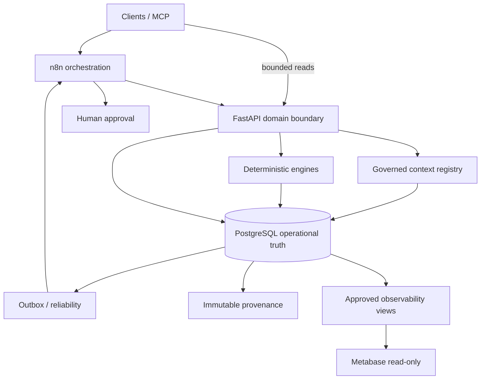

# North Star Workload Optimizer

North Star is a governed expense-operations reference system. It combines deterministic policy execution, durable workflow orchestration, authoritative enterprise context, immutable decision provenance, regression evaluation, read-only observability, and a controlled MCP interface. Financial outcomes are decided by versioned Python logic—not an LLM—while MCP-compatible clients can inspect trusted context and invoke existing governed workflows.

## What North Star demonstrates

- Separation of operator-visible orchestration from deterministic domain logic.
- Safe abstention when policy ownership, certification, freshness, or engine binding is not authoritative.
- Durable human approval and recoverable external effects across restarts.
- Evidence-backed decisions that retain the policy, context, rules, risk signals, and human action used at decision time.
- Reproducible local release infrastructure with deterministic tests and benchmarks.

## Architecture


```mermaid
flowchart TD
    Clients["Clients / MCP"] --> N8N["n8n orchestration"]
    Clients -->|"bounded reads"| API["FastAPI domain boundary"]
    N8N --> API
    API --> Context["Governed context registry"]
    API --> Engines["Deterministic engines"]
    Context --> PG[("PostgreSQL operational truth")]
    Engines --> PG
    API --> PG
    PG --> Reliability["Outbox / reliability"]
    PG --> Provenance["Immutable provenance"]
    Reliability --> N8N
    N8N --> Human["Human approval"]
    PG --> Views["Approved observability views"]
    Views --> MB["Metabase read-only"]
```

MCP write tools route through n8n; they do not bypass orchestration. Metabase can select only approved `observability.*` views through a dedicated read-only role. The release uses separate `northstar`, `n8n_app`, and `metabase_app` databases and principals. See the [current architecture](docs/architecture/FINAL_ARCHITECTURE.md) and [ADRs](docs/adr).

## Core engineering properties

- Deterministic validation, anomaly signals, risk classification, and approval routing; no LLM makes financial decisions.
- PostgreSQL transactions, idempotency keys, correlation, immutable human decisions, and durable n8n Wait/resume state.
- Transactional outbox, leases, bounded retry, delivery attempts, dead-letter/replay, and reconciliation.
- At-least-once delivery with idempotent consumers/effects—not an exactly-once claim.
- Forward-only Alembic migrations and hash-locked Python dependencies for Python 3.13.9.

## Governed context and provenance

Policy and business-term versions carry ownership, certification, effective periods, freshness evidence, and deterministic hashes. North Star abstains before persisting a financial decision when required context is missing, conflicted, stale, untrusted, or inconsistent with the engine manifest.

Every persisted decision records canonical context, rule, risk-signal, engine, and later human-decision evidence. References retain navigability; immutable snapshots preserve historical meaning; deterministic hash verification detects evidence changes.

## Reliability model

Business state and external-effect intent commit in one PostgreSQL transaction. Leased workers deliver outbox events with stable delivery keys, record every attempt, retry transient failures, and move exhausted events to a replayable dead-letter state. This produces recoverable at-least-once delivery; downstream effects must remain idempotent.

## Evaluation

Conventional tests and deterministic benchmark cases answer different questions:

| Evidence | Verified Gate 9 result |
|---|---:|
| SQLite pytest | 122 passed, 13 skipped |
| PostgreSQL pytest | 134 passed, 1 skipped |
| Gate 5 FAST benchmark | 37/37 |
| Gate 5 PostgreSQL benchmark | 37/37 |
| MCP FAST contract benchmark | 17/17 |
| MCP PostgreSQL+n8n stdio benchmark | 16/16 |

The Gate 5 safety cases measured unsafe actions `0/7`, abstention recall `7/7`, abstention precision `7/7`, and provenance verification `23/23`. These are exact results on curated, versioned deterministic cases—not statistical model accuracy or evidence of generalization to production data. See [evaluation design](evals/README.md) and the [portfolio evidence matrix](docs/PORTFOLIO_EVIDENCE.md).

## MCP interface

The official MCP Python SDK 2.0.0 provider exposes 12 tools, five resource templates, and one optional prompt. stdio is the primary transport; local Streamable HTTP rejects non-loopback bindings. Consequential actions follow `MCP → n8n → FastAPI → PostgreSQL/HITL`. HTTP mode is demo/local only because authentication and MCP OAuth are not implemented.

## Observability

Metabase OSS 0.63.2.7 reconciles 36 source-controlled questions across five dashboards: operations, approval/SLA, reliability/recovery, governed-context health, and decision trace/risk. Its source role is read-only and limited to approved views. Dashboards show structural provenance completeness; cryptographic provenance verification remains an application operation, not a SQL claim.

## Quick start

Prerequisites: Docker Desktop with Compose, Git, and Python 3.13.9. PowerShell is the verified Windows shell.

```powershell
git clone <repository-url>
Set-Location northstar-workload-optimizer
Copy-Item .env.example .env
# Replace every change-me value with a disposable local secret.

python -m venv .venv
.\.venv\Scripts\python.exe -m pip install uv==0.12.3
.\.venv\Scripts\uv.exe pip sync --python .\.venv\Scripts\python.exe --require-hashes requirements.lock

.\scripts\stack.ps1 up
.\scripts\stack.ps1 verify
```

The stack brings up PostgreSQL 16.14, applies migrations and governed-context seed data, starts FastAPI, imports exactly ten n8n workflows, and reconciles Metabase's five dashboards and 36 questions. The verifier then exercises the suspicious-expense, approval, Wait/resume, outbox, human-evidence, and provenance path.

Loopback endpoints are FastAPI `http://127.0.0.1:8000/docs`, n8n `http://127.0.0.1:5679`, Metabase `http://127.0.0.1:3000`, and PostgreSQL debugging `127.0.0.1:55432`. Stop without deleting demo volumes using `.\scripts\stack.ps1 down`.

## Demo

Use the [interview demo script](docs/DEMO_SCRIPT.md) for prepared 30-second, five-minute, and ten-minute versions. [DEMO.md](DEMO.md) retains the detailed manual Windows workflow.

For MCP development, the official SDK Inspector command is:

```powershell
$env:UV_CACHE_DIR="$PWD\.tmp\uv-cache"
.\.venv\Scripts\uv.exe run mcp dev mcp_server\server.py
```

## Tests

```powershell
# Full non-live mirror: dependency lock, compile, pip, validators,
# SQLite pytest, Gate 5 FAST, MCP FAST, and whitespace checks.
.\.venv\Scripts\python.exe scripts\release_check.py

# Individual deterministic benchmarks.
.\.venv\Scripts\python.exe -m scripts.run_evals --profile fast
.\.venv\Scripts\python.exe -m scripts.run_mcp_evals --profile fast
```

GitHub Actions workflows are defined for static, SQLite, PostgreSQL 16.14, Docker structural, and manual full-stack integration checks. Their commands mirror locally verified release commands; this repository does not claim a remote GitHub Actions run has passed.

## Documentation

- [Detailed current architecture](docs/architecture/FINAL_ARCHITECTURE.md)
- [Current released runtime baseline](docs/architecture/CURRENT_STATE.md)
- [Capability-to-evidence matrix](docs/PORTFOLIO_EVIDENCE.md)
- [Interview demo and talk track](docs/DEMO_SCRIPT.md)
- [Security boundaries and production gaps](docs/SECURITY_BOUNDARIES.md)
- [Architecture decisions](docs/adr)
- [Historical gate evidence](docs/architecture)

Files named `G*.md` are historical implementation/release evidence. `FINAL_ARCHITECTURE.md` and `CURRENT_STATE.md` describe the current system.

## Security and limitations

The release is a loopback-only demonstration foundation, not an internet-facing production deployment. It does not implement production authentication, identity-bound approvers, RBAC, MCP OAuth, TLS termination, a secret manager, cloud network policy, backups/HA, or real notification providers. Do not expose it to an untrusted network. Voice is intentionally deferred and is not required by this release. See [security boundaries](docs/SECURITY_BOUNDARIES.md).
