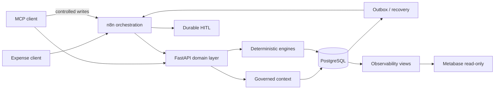

# North Star Workload Optimizer

North Star is a deterministic expense-control system built to make automated decisions safe, explainable, durable, and demonstrable. n8n coordinates webhooks and human waits; FastAPI owns financial policy behavior; PostgreSQL preserves operational truth; governed context can force safe abstention; immutable provenance explains every persisted decision; Metabase observes through a read-only boundary; and MCP exposes a minimized client interface.

## Architecture


```mermaid
flowchart LR
    Client["Expense client"] --> N8N["n8n orchestration"]
    MCP["MCP client"] --> API["FastAPI domain layer"]
    MCP -->|"controlled writes"| N8N
    N8N --> API
    API --> Context["Governed context"]
    API --> Engine["Deterministic engines"]
    Context --> PG[("PostgreSQL")]
    Engine --> PG
    PG --> Outbox["Outbox / recovery"]
    Outbox --> N8N
    N8N --> Human["Durable HITL"]
    PG --> Views["Observability views"]
    Views --> MB["Metabase read-only"]
```

The release stack uses separate `northstar`, `n8n_app`, and `metabase_app` databases and principals. See [final architecture](docs/architecture/FINAL_ARCHITECTURE.md), [ADRs](docs/adr), and [security boundaries](docs/SECURITY_BOUNDARIES.md).

## Engineering properties

- Deterministic validation, anomaly detection, risk classification, and approval routing; no LLM decides financial policy.
- PostgreSQL transactions, idempotency, correlation, immutable human decisions, and durable n8n Wait/resume.
- Transactional outbox with leasing, bounded retries, delivery attempts, dead-letter/replay, and reconciliation. Delivery is explicitly at least once.
- Versioned policy/business-term ownership, certification, freshness and engine binding. Unsafe context causes abstention before a decision is persisted.
- Canonical provenance snapshots and references with hash verification and lineage APIs.
- Versioned deterministic evaluation data and baselines.
- Official MCP Python SDK v2 provider: 12 tools, five resource templates, one prompt; stdio is primary and HTTP is loopback-only.
- Metabase OSS 0.63.2.7: 36 source-controlled questions across five dashboards, reading only approved `observability.*` views.

## Verified evaluation evidence

- Gate 5: 37 benchmark cases; unsafe action rate `0/7`; provenance verification `23/23`.
- MCP: FAST `17/17`; PostgreSQL+n8n stdio `16/16`.
- Gate 7 baseline: SQLite `113 passed, 13 skipped`; PostgreSQL `125 passed, 1 skipped`.

These are deterministic release-baseline results, not claims of production security or exactly-once delivery.

## Quick start: reproducible stack

Prerequisites: Docker Desktop with Compose, Git, and Python 3.13.9. PowerShell is the verified Windows shell.

```powershell
git clone <repository-url>
Set-Location northstar-workload-optimizer
Copy-Item .env.example .env
# Edit .env and replace every change-me value with disposable local secrets.

python -m venv .venv  # use a Python 3.13.9 executable
.\.venv\Scripts\python.exe -m pip install uv==0.12.3
.\.venv\Scripts\uv.exe pip sync --python .\.venv\Scripts\python.exe --require-hashes requirements.lock

.\scripts\stack.ps1 up
.\scripts\stack.ps1 verify
```

Endpoints are loopback-only by default:

- FastAPI: `http://127.0.0.1:8000/docs`
- n8n: `http://127.0.0.1:5679`
- Metabase: `http://127.0.0.1:3000`
- PostgreSQL debugging: `127.0.0.1:55432`

Stop without deleting durable demo volumes:

```powershell
.\scripts\stack.ps1 down
```

Do not expose this stack to an untrusted network. Read [security boundaries](docs/SECURITY_BOUNDARIES.md) first.

## Local/manual mode

Docker is additive: SQLite tests, local FastAPI, local n8n, and MCP stdio remain usable. The detailed Windows sequence is in [DEMO.md](DEMO.md). Use the official SDK Inspector during development:

```powershell
$env:UV_CACHE_DIR="$PWD\.tmp\uv-cache"
.\.venv\Scripts\uv.exe run mcp dev mcp_server\server.py
```

## Tests and release checks

```powershell
# Full non-live local mirror: lock, compile, pip, validators, SQLite, Gate 5 FAST, MCP FAST
.\.venv\Scripts\python.exe scripts\release_check.py

# Individual suites
.\.venv\Scripts\python.exe -m pytest -q
.\.venv\Scripts\python.exe -m scripts.run_evals --profile fast
.\.venv\Scripts\python.exe -m scripts.run_mcp_evals --profile fast

# Live stack inventory + suspicious expense + approval + Wait/outbox/provenance
.\scripts\stack.ps1 verify
```

The primary CI workflow runs static, SQLite, PostgreSQL 16.14, and Docker build/config jobs. A manual integration workflow starts the full Compose stack and runs live MCP/Metabase checks.

## Demo and design documentation

- [Five-minute demo and technical talk track](docs/DEMO_SCRIPT.md)
- [Gate 9 release design](docs/architecture/G9_REPRODUCIBLE_RELEASE.md)
- [Final architecture](docs/architecture/FINAL_ARCHITECTURE.md)
- [Security boundaries](docs/SECURITY_BOUNDARIES.md)
- [Coding-agent invariants](AGENTS.md)
- [Gate history](docs/architecture)

Voice, production identity/RBAC, remote MCP authentication, TLS, production secret management, HA/backups, and real notification providers are intentionally outside this release.
