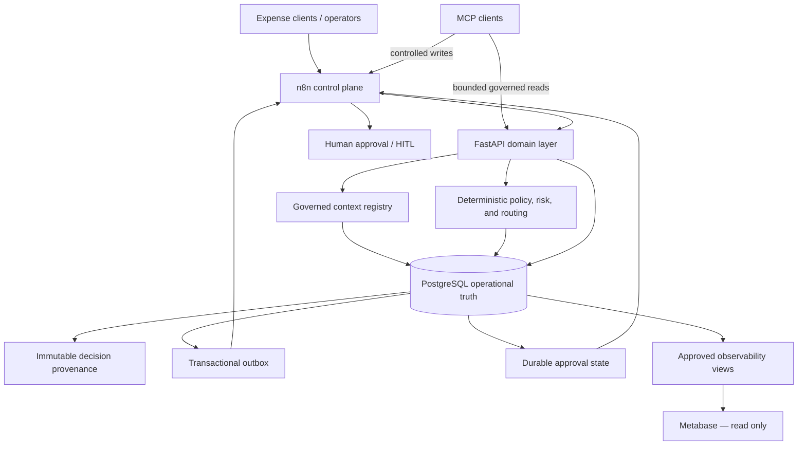
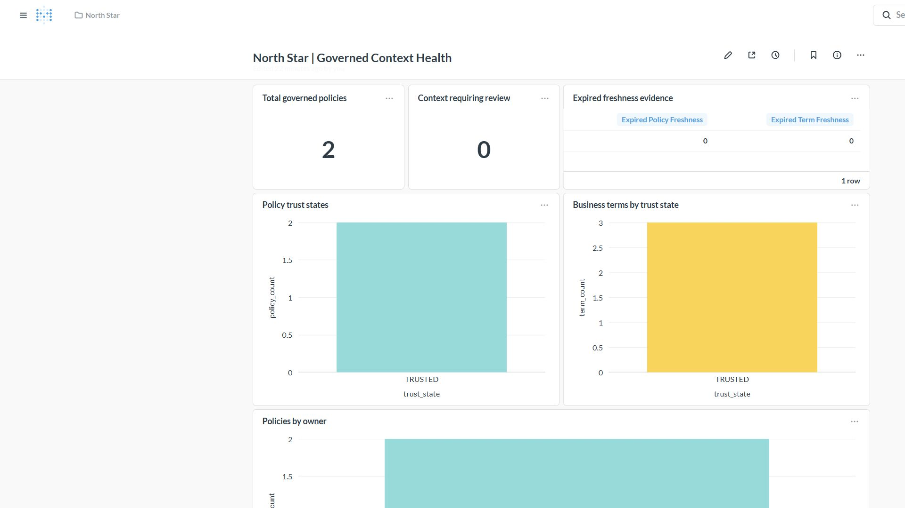
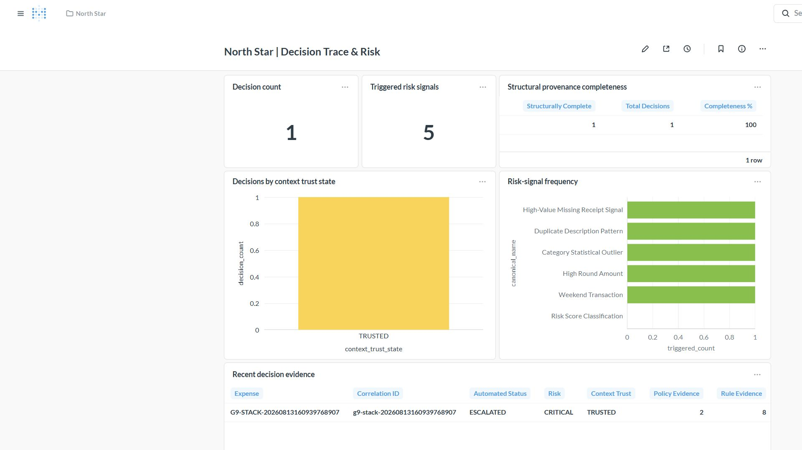
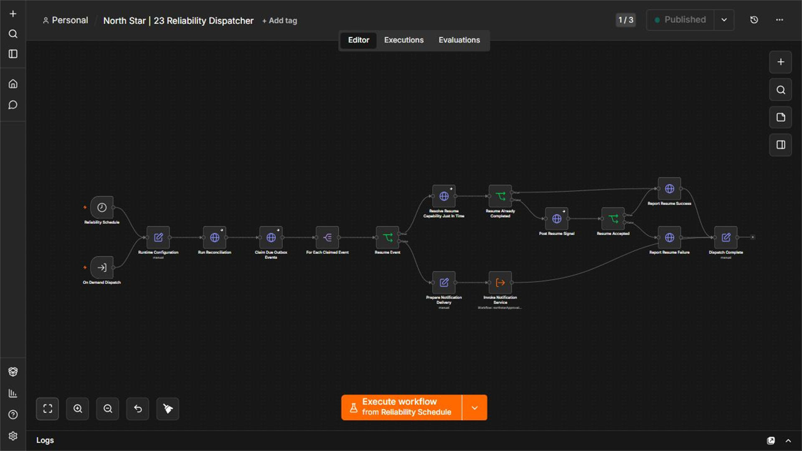

# North Star Workload Optimizer

**A governed expense-operations system for decisions that must be explainable, reproducible, and recoverable.**

[](https://github.com/tusharg007/northstar-workload-optimizer/actions/workflows/ci.yml)


[](LICENSE)

North Star separates deterministic financial policy from workflow orchestration and AI-facing interfaces. n8n coordinates long-running work and human approval; FastAPI and versioned Python logic own decisions; PostgreSQL preserves operational truth, recovery state, governed context, and immutable evidence; Metabase observes through a read-only boundary; and MCP exposes trusted reads and controlled actions without becoming a policy authority.

## Why I built North Star

Most workflow demos end when a request reaches an approver. I wanted to explore the harder problems that appear after the happy path: What happens when policy meaning changes while a workflow is running? What happens when a human decision takes hours? What happens when a retry follows a partial failure? And if an AI client invokes the system, how can it access useful context without becoming the authority for financial policy?

North Star became my attempt to design that boundary properly.

The central thesis is simple: **automation should act on a policy-dependent decision only when it can establish that the governing context is authoritative.** The system therefore combines versioned context, deterministic decisions, durable orchestration, failure recovery, immutable evidence, evaluation, observability, and a controlled MCP interface.

## The core problem

Expense automation is deceptively difficult:

- Policy meaning can drift while a request is in flight.
- Business definitions need accountable owners, certification, effective dates, and freshness evidence.
- Human approvals must survive process and workflow-engine restarts.
- Retried effects can create duplicate notifications or resumes.
- Operators need to see failures and recovery state without gaining a new write path.
- A decision must remain explainable after the current policy has changed.
- AI clients need useful context but must not silently become financial-policy authorities.

North Star treats these as system invariants rather than edge cases.

## Design principles

**Context before action.** Policy-dependent processing abstains when authoritative context cannot be proven.

**Deterministic financial policy.** LLMs do not determine approval policy, risk classification, routing, or financial outcomes.

**Orchestration is not domain logic.** n8n owns visible workflow coordination; FastAPI and Python own deterministic behavior.

**PostgreSQL is durable truth.** Operational state, approvals, outbox events, governed context, and provenance are persisted transactionally.

**Failures are part of the design.** At-least-once delivery, idempotency, leases, retries, dead-letter/replay, and reconciliation are explicit.

**Evidence survives policy change.** Provenance records the context, rules, trust signals, risk evidence, engine versions, and human action used at decision time.

**AI gets a governed interface.** MCP exposes minimized trusted reads and controlled actions while preserving n8n, FastAPI, PostgreSQL, and human-approval boundaries.

## Architecture


```mermaid
flowchart TD
    Clients["Expense clients / operators"] --> N8N["n8n control plane"]
    MCP["MCP clients"] -->|"controlled writes"| N8N
    MCP -->|"bounded governed reads"| API["FastAPI domain layer"]
    N8N --> API

    API --> Context["Governed context registry"]
    API --> Engines["Deterministic policy, risk, and routing"]
    Context --> PG[("PostgreSQL operational truth")]
    Engines --> PG
    API --> PG

    PG --> Provenance["Immutable decision provenance"]
    PG --> Outbox["Transactional outbox"]
    PG --> Approval["Durable approval state"]
    Outbox --> N8N
    Approval --> N8N
    N8N --> Human["Human approval / HITL"]

    PG --> Views["Approved observability views"]
    Views --> Metabase["Metabase — read only"]
```

MCP is not a second orchestrator. Consequential calls follow `MCP → n8n → FastAPI → PostgreSQL/HITL`. Metabase is not in the transaction path and cannot mutate operational data.

## What makes it interesting

| Engineering problem | North Star design response |
|---|---|
| Policy drift | Versioned governed context with ownership, effective-time resolution, certification, and trust |
| Unsafe or missing context | Deterministic abstention before decision persistence |
| Long-running approval | Durable n8n Wait plus PostgreSQL approval/orchestration state |
| Crash window between commit and external effect | Transactional outbox |
| Retry duplicates | Canonical request idempotency and stable delivery keys |
| Failed delivery | Leases, bounded retry, delivery attempts, DLQ/replay, and reconciliation |
| Historical explainability | Immutable provenance snapshots, references, and deterministic hashes |
| AI/client integration | Governed MCP resources/tools with n8n-routed writes |
| Operator visibility | Read-only Metabase views and dashboards |
| Regression confidence | Versioned deterministic evaluation harness with exact metrics |
| Reproducibility | Hash-locked dependencies, Docker Compose bootstrap, and CI definitions |

## System in action



*Governed enterprise context — versioned policies and business terms carry ownership, certification, effective-time semantics, and trust/freshness signals before they can influence decisions.*



*Decision provenance and risk evidence — each expense records the governed context, deterministic risk evidence, and policy/rule evidence behind its decision trace. Structural completeness is distinct from cryptographic hash verification.*



*Durable workflow recovery — n8n dispatches transactional-outbox intents through reconciliation, claiming, resume/notification paths, and explicit success/failure reporting while PostgreSQL remains the source of truth.*

The [approval-orchestrator image](docs/assets/portfolio/approval-orchestrator.png) provides a closer interview view of registration, notification, durable Wait, final-state retrieval, and completion.

## Synthetic demo scenario

The verified demonstration uses clearly synthetic data: a **$3,000 Software & Subscriptions** expense with a duplicate-style description, missing receipt, weekend date, and other deterministic signals.

| Stage | Verified result |
|---|---|
| Automated decision | `ESCALATED` |
| Risk | `CRITICAL` |
| Route | `Finance Director + Compliance` |
| Human decision | `APPROVED` |
| Provenance verification | `PASS` |
| Approval-resume outbox | `DELIVERED` |
| n8n orchestration | `COMPLETED` |

This scenario is a deterministic release fixture, not real enterprise expense data.

## Verified engineering evidence

These are exact regression, contract, and release checks—not production model accuracy or real-world ML generalization.

| Evidence | Verified result |
|---|---:|
| SQLite pytest | 122 passed, 13 skipped |
| PostgreSQL pytest | 134 passed, 1 skipped |
| Gate 5 FAST benchmark | 37/37 |
| Gate 5 PostgreSQL benchmark | 37/37 |
| Unsafe-action rate | 0/7 |
| Abstention recall / precision | 7/7 · 7/7 |
| Provenance verification | 23/23 |
| MCP FAST benchmark | 17/17 |
| MCP PostgreSQL+n8n stdio | 16/16 |
| MCP contract | 12 tools · 5 resources · 1 prompt |
| n8n inventory | 10 workflows |
| Metabase inventory | 5 dashboards · 36 questions |
| Fresh Compose bootstrap | PASS |
| n8n waiting-execution restart persistence | PASS |
| Whole-stack restart persistence | PASS |
| Fresh-volume recreation | PASS |

The immutable v1 evaluation dataset covers exact decisions, risk signals, routing, context resolution, abstention, provenance, idempotency, and selected reliability behavior. No LLM judge participates.

## Reliability model

Business state and external-effect intent commit in one PostgreSQL transaction. Workers reconcile missing intents, claim due events with expiring leases, record each delivery attempt, retry transient failures, and move exhausted work into an explicit replayable dead-letter state.

The delivery guarantee is **at least once**, not exactly once. Stable delivery keys and idempotent consumers/effects make retries safe.

## Governed context and provenance

Policy and business-term versions carry accountable ownership, certification, effective intervals, review dates, freshness evidence, and deterministic hashes. Required context is resolved at one effective time and checked against the engine manifest. Missing, conflicted, stale, untrusted, or mismatched context produces a safe abstention before a financial decision is persisted.

Each persisted decision stores canonical context, rule, trust, risk-signal, and engine evidence. References retain navigability; immutable snapshots preserve historical meaning. Human evidence is appended later without rewriting the automated-decision hash.

## MCP boundary

The official MCP Python SDK 2.0.0 provider exposes **12 tools, five resource templates, and one investigation prompt**. stdio is the primary transport; local Streamable HTTP rejects non-loopback bindings.

- Reads expose bounded governed context, expense state, explanations, lineage, decision traces, and provenance verification.
- Writes preserve `MCP → n8n → FastAPI → PostgreSQL/HITL`.
- MCP has no direct database access and cannot invoke internal Wait/resume capabilities.
- HTTP mode is local/demo only because production authentication and MCP OAuth are not implemented.

## Observability

Metabase OSS 0.63.2.7 reconciles **36 source-controlled questions across five dashboards**:

- Operations Overview
- Approval & SLA
- Reliability & Recovery
- Governed Context Health
- Decision Trace & Risk

Its dedicated PostgreSQL role can select only approved `observability.*` views. Base-table reads and all writes are denied. Dashboards report structural provenance completeness; cryptographic verification remains an application operation.

## Quick start

Prerequisites: Docker Desktop with Compose, Git, and Python 3.13.9. PowerShell is the fully verified local workflow.

```powershell
git clone https://github.com/tusharg007/northstar-workload-optimizer.git
Set-Location northstar-workload-optimizer
Copy-Item .env.example .env
# Replace every change-me value with a disposable local secret.

python -m venv .venv
.\.venv\Scripts\python.exe -m pip install uv==0.12.3
.\.venv\Scripts\uv.exe pip sync --python .\.venv\Scripts\python.exe --require-hashes requirements.lock

.\scripts\stack.ps1 up
.\scripts\stack.ps1 verify
```

The stack starts PostgreSQL 16.14, applies migrations and governed-context seed data, starts FastAPI, imports exactly ten n8n workflows, and reconciles five Metabase dashboards and 36 questions. Verification exercises the synthetic suspicious-expense, approval, Wait/resume, outbox, human-evidence, and provenance path.

Loopback endpoints:

- FastAPI: `http://127.0.0.1:8000/docs`
- n8n: `http://127.0.0.1:5679`
- Metabase: `http://127.0.0.1:3000`
- PostgreSQL debugging: `127.0.0.1:55432`

Stop without deleting durable demo volumes:

```powershell
.\scripts\stack.ps1 down
```

Do not expose this stack to an untrusted network.

## Tests and evaluations

```powershell
# Lock, compile, pip, validators, SQLite, Gate 5 FAST, MCP FAST, whitespace.
.\.venv\Scripts\python.exe scripts\release_check.py

# Individual deterministic benchmarks.
.\.venv\Scripts\python.exe -m scripts.run_evals --profile fast
.\.venv\Scripts\python.exe -m scripts.run_mcp_evals --profile fast
```

GitHub Actions defines static, SQLite, PostgreSQL 16.14, Docker structural, and manual full-stack integration checks. The commands mirror the locally verified release process.

## Repository map

| Area | Ownership |
|---|---|
| [`app/`](app) | FastAPI contracts, persistence, approvals, reliability, context, and provenance |
| [`n8n/`](n8n) | Ten source-controlled orchestration workflows |
| [`context/`](context) | Governed seed registry and deterministic risk-signal catalog |
| [`evals/`](evals) | Immutable versioned datasets, baseline, metrics, and reporting |
| [`mcp_server/`](mcp_server) | Governed MCP tools, resources, prompt, and transport adapter |
| [`metabase/`](metabase) | Dashboard manifest, SQL questions, bootstrap, and validators |
| [`observability/`](observability) | Approved analytical view definitions |
| [`alembic/`](alembic) | Forward-only PostgreSQL schema history |
| [`infra/`](infra) | Reproducible Docker runtime assets |
| [`scripts/`](scripts) | Release, stack, seed, smoke, and evaluation commands |
| [`tests/`](tests) | Unit, contract, integration, persistence, and release checks |
| [`docs/`](docs) | Current architecture, evidence, demo, security boundaries, ADRs, and gate history |

## Security and production limits

Implemented boundaries include authoritative-context checks, safe abstention, immutable provenance, deterministic financial policy, a read-only Metabase database role, minimized MCP outputs, loopback-only MCP HTTP, separate service databases/principals, and no committed secrets.

This remains a local reference release, not an internet-facing production deployment. Production work would require:

- User authentication, identity-bound approval, RBAC, and tenant isolation.
- MCP OAuth, TLS termination, authenticated ingress, and cloud network policy.
- Managed secret storage and rotation.
- A real notification provider with idempotency support.
- Backup/restore automation, high availability, and disaster recovery.
- Broader SLO monitoring and representative evaluation datasets.

Voice is intentionally deferred and is not required by the architecture.

## Documentation

- [Current detailed architecture](docs/architecture/FINAL_ARCHITECTURE.md)
- [Capability-to-evidence matrix](docs/PORTFOLIO_EVIDENCE.md)
- [Interview demo and talk track](docs/DEMO_SCRIPT.md)
- [Security boundaries](docs/SECURITY_BOUNDARIES.md)
- [Architecture decision records](docs/adr)
- [Historical engineering gate evidence](docs/architecture)

`FINAL_ARCHITECTURE.md` describes the current system. Files named `G*.md` preserve the implementation and verification history behind it.

## License

[MIT](LICENSE)
