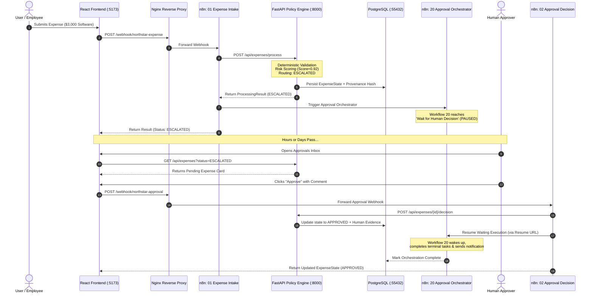

# 🌟 North Star: Complete Architecture & Engineering Master Study Guide
> **A Comprehensive First-Principles Guide to Deterministic AI Systems, Durable Multi-Agent Orchestration (n8n), Model Context Protocol (MCP), Decision Provenance, Evals, Guardrails & Full-Stack Reliability.**

---

## 📌 Table of Contents
1. [Executive Summary & The Core Problem](#1-executive-summary--the-core-problem)
2. [Foundations from Scratch (0-to-1 Fundamentals)](#2-foundations-from-scratch-0-to-1-fundamentals)
   - What is Fullstack Architecture?
   - Deterministic Guardrails vs Non-Deterministic LLMs
   - Agentic AI & Multi-Agent Orchestration
   - Durable Orchestration & Long-Lived Human-in-the-Loop (HITL)
   - Model Context Protocol (MCP)
   - Cryptographic Provenance & Immutable Audit Trails
   - Transactional Outbox Pattern & Reliability Engineering
   - AI Evals, Golden Datasets & Gate Harnesses
   - Containerization & Docker Runtime Topologies
3. [System Architecture & End-to-End Data Flow](#3-system-architecture--end-to-end-data-flow)
   - High-Level Topology
   - Detailed Execution Traces (Auto-Approval, Escalation & HITL, Rejection)
4. [Deep-Dive Code Walkthrough (Component by Component)](#4-deep-dive-code-walkthrough-component-by-component)
   - Component 1: Deterministic Domain & Policy Engine (`automation/`)
   - Component 2: FastAPI Application Core (`app/`)
   - Component 3: Governed Context Registry (`app/context/`)
   - Component 4: Immutable Decision Provenance (`app/provenance/`)
   - Component 5: Transactional Outbox & Reliability Layer (`app/reliability/`)
   - Component 6: n8n Durable Orchestration (`n8n/workflows/`)
   - Component 7: Model Context Protocol (MCP) Server (`mcp_server/`)
   - Component 8: React Operations Dashboard & Nginx Gateway (`frontend/`)
   - Component 9: Observability, SQL Views & Metabase (`observability/`, `metabase/`)
   - Component 10: AI Evaluations & Regression Gates (`evals/`)
5. [Why We Designed It This Way: Architectural Trade-Offs](#5-why-we-designed-it-this-way-architectural-trade-offs)
6. [Interview Playbook: Top 20 Questions & Master-Level Answers](#6-interview-playbook-top-20-questions--master-level-answers)
7. [Rebuilding North Star from Scratch: 10-Step Blueprint](#7-rebuilding-north-star-from-scratch-10-step-blueprint)

---

# 1. Executive Summary & The Core Problem

### The Problem in Enterprise AI
Most modern "AI Enterprise" projects suffer from the **"Demo-to-Production Chasm"**:
1. **Hallucination in Financial/Legal Decisions:** LLMs are statistical next-token predictors. Letting an LLM directly decide whether to approve a $50,000 corporate expense or deny an insurance claim introduces legal liability, bias, and non-deterministic financial risk.
2. **Brittle Agentic Loops:** Scripts using standard loops or naive Celery tasks fail when a human takes 4 days to review an expense. In-memory states get wiped when containers restart.
3. **Lack of Verifiable Auditability:** When an auditor asks *"Why was this $3,000 invoice approved on a Sunday?"*, standard LLM chat logs provide zero legal evidence, zero version pinning, and zero cryptographic proof of data integrity.
4. **Terminal-Heavy, Un-demonstrable Complexity:** Systems are often scattered across terminal CLI scripts, raw SQL, and uncoordinated microservices that recruiters and enterprise stakeholders cannot visualize.

### The North Star Solution
**North Star** is a production-grade, governed enterprise expense operations platform built on a **Non-Negotiable Architecture**:
- **Zero LLM Authority over Financial Policy:** All financial validation, anomaly detection, risk scoring, and routing are strictly deterministic (Python domain layer).
- **Durable Multi-Agent Orchestration (n8n):** Workflow nodes coordinate events and maintain state across minutes, days, or months using durable `Wait` states.
- **Cryptographic Decision Provenance:** Every automated decision generates a deterministic SHA-256 hash bundling the exact source payload, policy version, business term definitions, and risk rules as of that exact millisecond.
- **Model Context Protocol (MCP):** AI agents interface with the system strictly through a governed, type-safe MCP layer with read-only guardrails and monitored write bridges.
- **Clean Full-Stack UI:** A responsive React 18 dashboard served via Nginx reverse proxy turns a complex 10-workflow, multi-service backend into a 1-command, click-driven operational experience.

---

# 2. Foundations from Scratch (0-to-1 Fundamentals)

### A. Fullstack Architecture
- **Client (Frontend):** The User Interface (UI) running in the user's browser (React + TypeScript + Tailwind CSS). It captures inputs and renders dashboards.
- **Reverse Proxy / Gateway (Nginx):** A middleman server that intercepts all incoming browser traffic on port `5173`. It routes `/api/*` requests to FastAPI (`:8000`), `/webhook/*` requests to n8n (`:5679`), and serves static HTML/CSS/JS files for everything else. This eliminates CORS issues in production.
- **Application Server (Backend):** FastAPI (Python) running business logic, policy evaluations, and exposing REST endpoints.
- **Database (PostgreSQL):** The permanent relational source of truth where tables, outbox events, and audit logs are safely stored on disk.

```
[ Browser (React UI) ]
         │ (HTTP :5173)
         ▼
  [ Nginx Proxy ]
    ├── /webhook/* ──► [ n8n Engine (:5679) ] ──┐
    └── /api/*     ──► [ FastAPI (:8000) ] ◄────┘
                              │
                              ▼
                     [ PostgreSQL (:55432) ]
```

### B. Deterministic Guardrails vs Non-Deterministic LLMs
- **Non-Deterministic (LLM):** If you give GPT-4 the prompt *"Is this $500 dinner valid under policy?"*, it might say "Yes" 95% of the time and "No" 5% of the time due to sampling temperature. In enterprise compliance, 5% error is catastrophic.
- **Deterministic Code:** Python functions using strict math and logic:
  ```python
  if amount > 500.0 and not receipt_attached:
      return RiskEvaluation(flags=["MISSING_RECEIPT_OVER_THRESHOLD"], risk="HIGH")
  ```
  This returns the exact same result $100\%$ of the time across billions of executions.
- **The Guardrail Principle:** LLMs may summarize text, assist in search, or query interfaces, but **no LLM may evaluate policy, score financial risk, or persist financial decisions.**

### C. Agentic AI & Multi-Agent Orchestration
- **Agentic AI:** An AI system that does not just answer questions, but autonomously perceives its environment, reasons through a sequence of steps, invokes external tools (APIs, databases), and acts to achieve a goal.
- **Multi-Agent Systems:** Instead of one giant, fragile prompt trying to do everything, specialized autonomous workers (agents) collaborate. In North Star:
  - Agent 1: Ingests and normalizes expense payloads.
  - Agent 2: Runs compliance verification and checks SLA monitors.
  - Agent 3: Escalates and manages human-in-the-loop notifications.
  - Agent 4: Dispatches transactional outbox events reliably.

### D. Durable Orchestration & Long-Lived Human-in-the-Loop (HITL)
- **Standard Async (Celery / Background Tasks):** Keeps a task in memory or Redis. If a manager takes 3 days to approve an expense, or the worker container restarts, the execution is lost.
- **Durable Orchestration (n8n):** When an expense requires human approval:
  1. The workflow reaches a `Wait for Webhook / Decision` node.
  2. The workflow state is serialized and persisted to PostgreSQL.
  3. The workflow process **pauses and releases all CPU/RAM resources**.
  4. Days later, when the manager clicks "Approve" in the UI, an HTTP POST hits `/webhook/northstar-approval`.
  5. n8n retrieves the serialized execution from PostgreSQL and **resumes execution at the exact next step**.

### E. Model Context Protocol (MCP)
- **What is MCP?** An open standard created by Anthropic that standardizes how AI applications (Claude Desktop, IDE agents, custom Copilots) connect to external data sources and tools.
- **The Architecture:**
  - **Host:** The AI client (e.g., Claude Desktop, Antigravity).
  - **Client:** The connector inside the host.
  - **Server:** A lightweight process (`mcp_server`) exposing:
    - **Tools:** Callable actions (e.g., `get_expense_status`, `search_policy_context`).
    - **Resources:** Structured data URIs (e.g., `northstar://policies`, `northstar://terms`).
    - **Prompts:** Parameterized prompt templates enforcing compliance.
- **Safety Annotations in North Star MCP:**
  ```python
  READ_ONLY = ToolAnnotations(readOnlyHint=True, destructiveHint=False, idempotentHint=True)
  APPROVE   = ToolAnnotations(readOnlyHint=False, destructiveHint=True, idempotentHint=True)
  ```

### F. Cryptographic Provenance & Immutable Audit Trails
- **The Core Idea:** You cannot simply store `status = "APPROVED"` in a database because a database admin could manually update a row.
- **The Solution:** For every decision, North Star compiles a **canonical JSON evidence bundle**:
  - Exact source payload
  - Policy Version IDs and rule parameters in effect at that timestamp
  - Certified Business Term definitions
  - Algorithmic risk signal scores
  - Human reviewer ID and digital signature/comment
- **The Cryptographic Hash:**
  $$\text{Provenance Hash} = \text{SHA-256}(\text{Canonical Canonicalized JSON Bundle})$$
- **Replay Verification:** Any auditor can call `GET /api/provenance/decisions/{id}/verify`. The backend pulls the historical evidence, re-hashes it on the fly, and asserts:
  $$\text{Stored Hash} \equiv \text{Recomputed Hash}$$
  If even a single character or dollar amount was modified in the database, the hashes mismatch and an integrity alarm fires.

### G. Transactional Outbox Pattern & Reliability Engineering
- **The Dual-Write Problem:** If your app updates the database AND sends an email notification, what happens if the network crashes after updating the DB but before sending the email? Data is inconsistent!
- **The Outbox Pattern:**
  1. Inside a single atomic database transaction:
     - Update the expense state.
     - Insert an event into the `outbox_events` table with status `PENDING`.
  2. A dedicated background worker (Workflow 23 - Reliability Dispatcher) polls `outbox_events` every 5 seconds.
  3. It delivers the notification to external sinks.
  4. Upon confirmed delivery, it marks the event `DELIVERED`.
  5. If delivery fails 5 times, it moves the event to the **Dead Letter Queue (DLQ)** for manual replay.

### H. AI Evals & Golden Datasets
- **Why Evals?** In AI and automated policy systems, you must prove that updates do not introduce silent regressions.
- **Golden Dataset:** An immutable JSON test dataset containing hundreds of historical edge cases (e.g., weekend transactions, high amounts, missing receipts, conflicting currencies).
- **Gate Evaluation:** Before deploying a release, a test harness runs all test cases through the engine and calculates:
  - **Precision:** Of all flagged anomalies, how many were true anomalies?
  - **Recall:** Did the engine catch 100% of the planted policy violations?
  - **Drift:** Did any output deviate from baseline v1?

### I. Containerization & Docker Runtime Topology
- **Docker:** Packages code, OS libraries, Python virtualenv, and Nginx into isolated, reproducible container images.
- **Compose Stack (`docker-compose.yml`):** Runs 10 interconnected services on a private internal bridge network (`northstar_private`), exposing only necessary host ports:
  - `5173`: React Frontend (Nginx)
  - `8000`: FastAPI Backend
  - `5679`: n8n Orchestrator
  - `3000`: Metabase Analytics
  - `55432`: PostgreSQL Database

---

# 3. System Architecture & End-to-End Data Flow



---

# 4. Deep-Dive Code Walkthrough (Component by Component)

```
┌─────────────────────────────────────────────────────────────────────────────┐
│                           NORTHSTAR WORKLOAD OPTIMIZER                       │
├───────────────────┬───────────────────┬───────────────────┬─────────────────┤
│    automation/    │       app/        │  n8n/workflows/   │   mcp_server/   │
│  Deterministic    │  FastAPI Backend  │  10 Orchestration │ Governed Model  │
│   Policy Engine   │  & Provenance DB  │     Workflows     │ Context Protocol│
├───────────────────┼───────────────────┼───────────────────┼─────────────────┤
│    frontend/      │   observability/  │      evals/       │  infra/docker/  │
│  React 18 + Vite  │ Metabase SQL Views│  Golden Dataset   │ Compose Stack & │
│  & Nginx Gateway  │   & Dashboards    │  Harness & Gates  │ PowerShell Mgmt │
└───────────────────┴───────────────────┴───────────────────┴─────────────────┘
```

---

### Component 1: Deterministic Domain & Policy Engine (`automation/`)

**Core Files:** `automation/automation_flow.py`, `automation/policy_manifest.py`, `automation/risk_classifier.py`

#### What it does:
This is the heart of the business logic. It takes raw input data and executes four deterministic stages:
1. **Pydantic Data Ingestion & Sanitization:** Enforces data types, date formats (`YYYY-MM-DD`), valid categories, and positive amounts.
2. **Policy Compliance Evaluation:** Tests hard enterprise rules:
   - `RECEIPT_REQUIRED_ABOVE = $75.00`
   - `DESCRIPTION_REQUIRED_ABOVE = $50.00`
   - `CATEGORY_LIMITS` (e.g., Meals max $150, Travel max $5,000).
3. **Algorithmic Risk Classification:** Calculates a normalized confidence risk score ($0.0 \text{ to } 1.0$) and assigns risk levels:
   - `LOW` ($< 0.35$)
   - `MEDIUM` ($0.35 - 0.65$)
   - `HIGH` ($0.65 - 0.85$)
   - `CRITICAL` ($> 0.85$)
   - Evaluates anomaly flags: `WEEKEND_TRANSACTION`, `HIGH_AMOUNT_FOR_CATEGORY`, `SUSPICIOUS_KEYWORD_MATCH` (e.g., "gift card", "crypto", "duplicate"), `ROUND_NUMBER_BIAS`.
4. **Approval Routing Engine:**
   - Low risk & $<\$100 \rightarrow$ `AUTO_APPROVED`
   - Normal expense $\rightarrow$ `PENDING_APPROVAL` (Routed to Direct Manager)
   - High risk or $>\$2,500 \rightarrow$ `ESCALATED` (Routed to VP / Finance Director + Compliance)

#### Key Code Structure:
```python
# automation/risk_classifier.py
def classify_expense_risk(submission: ExpenseSubmission) -> AnomalyResult:
    flags = []
    score = 0.0
    
    # Deterministic Rule: Weekend Check
    txn_date = datetime.strptime(submission.transaction_date, "%Y-%m-%d").date()
    if txn_date.weekday() >= 5:  # 5=Saturday, 6=Sunday
        flags.append("WEEKEND_TRANSACTION")
        score += 0.25

    # Deterministic Rule: Missing Receipt on large expense
    if submission.amount > 75.0 and not submission.receipt_attached:
        flags.append("MISSING_RECEIPT_OVER_THRESHOLD")
        score += 0.35

    # Deterministic Rule: Suspicious keyword detection
    suspicious_keywords = ["gift card", "crypto", "personal", "duplicate"]
    if any(kw in submission.description.lower() for kw in suspicious_keywords):
        flags.append("SUSPICIOUS_DESCRIPTION_KEYWORD")
        score += 0.40

    risk_level = "CRITICAL" if score >= 0.85 else "HIGH" if score >= 0.65 else "MEDIUM" if score >= 0.35 else "LOW"
    return AnomalyResult(
        is_anomalous=(score >= 0.35),
        confidence_score=min(1.0, score),
        risk_level=risk_level,
        flags=flags
    )
```

---

### Component 2: FastAPI Application Core (`app/`)

**Core Files:** `app/main.py`, `app/store.py`

#### What it does:
FastAPI provides the asynchronous REST API backend. It uses an **App Factory Pattern** (`create_app()`) to facilitate unit testing with temporary SQLite databases while running PostgreSQL in production.

#### Key Endpoints:
- `POST /api/expenses/process`: Runs full intake pipeline directly.
- `GET /api/expenses`: Returns filtered expense list with statuses.
- `GET /api/expenses/{id}`: Returns full individual expense state.
- `POST /api/expenses/{id}/decision`: Records human decision (Approve/Reject), logs human evidence, and inserts an `outbox_events` resume trigger.
- `GET /api/provenance/decisions/{id}/verify`: Replays cryptographic proof.
- `GET /health`: Microservice liveness probe.

---

### Component 3: Governed Context Registry (`app/context/`)

**Core Files:** `app/context/models.py`, `app/context/service.py`

#### What it does:
Enterprise policies and business definitions change over time (e.g., meal limits increase from $100 to $150). If you audit an expense from 2024, you must evaluate it against the **2024 policy version**, not today's version.

The Context Registry provides:
- **Immutable Policy Versions:** Version numbers ($1, 2, 3\dots$) with `effective_from` and `effective_to` timestamps.
- **Certified Content Hash:** Every policy version has a SHA-256 hash of its rule parameters.
- **Trust Signals:** Validates whether the context is authoritative or in drift.
- **Business Terms:** Formal enterprise definitions (e.g., *"What qualifies as 'Travel'?"*).

---

### Component 4: Immutable Decision Provenance (`app/provenance/`)

**Core Files:** `app/provenance/service.py`, `app/provenance/verifier.py`

#### How the Hashing Engine Works:
```
┌───────────────────────────────────────────────────────────┐
│                    PROVENANCE BUNDLE                       │
├───────────────────────────────────────────────────────────┤
│ 1. Normalized Source Payload                              │
│ 2. Certified Policy Versions & Parameter Hashes           │
│ 3. Certified Business Term Definitions                    │
│ 4. Algorithmic Risk Engine Version & Signal Outputs       │
│ 5. Workflow Correlation ID & Engine Version               │
│ 6. Human Approver ID, Timestamp & Comment (if applicable)  │
└─────────────────────────────┬─────────────────────────────┘
                              │
                              ▼
           Canonical JSON (Keys sorted alphabetically)
                              │
                              ▼
                     SHA-256 Hashing Algorithm
                              │
                              ▼
    [ e3b0c44298fc1c149afbf4c8996fb92427ae41e4649b934ca495991b7852b855 ]
```

```python
# app/provenance/verifier.py
def verify_provenance(record: ProvenanceRecord) -> VerifyResult:
    # 1. Reconstruct canonical dictionary of evidence
    canonical_dict = construct_canonical_evidence(record)
    # 2. Serialize to deterministic JSON with sorted keys
    serialized = json.dumps(canonical_dict, sort_keys=True, separators=(',', ':'))
    # 3. Compute SHA-256 hash
    recomputed_hash = hashlib.sha256(serialized.encode('utf-8')).hexdigest()
    
    # 4. Assert exact equality
    if recomputed_hash == record.stored_hash:
        return VerifyResult(status="PASS", stored_hash=record.stored_hash, recomputed_hash=recomputed_hash)
    else:
        return VerifyResult(status="FAIL", failures=["HASH_MISMATCH_DATA_TAMPERED"])
```

---

### Component 5: Transactional Outbox & Reliability (`app/reliability/`)

**Core Files:** `app/reliability/outbox.py`, `app/reliability/dlq.py`

#### What it does:
Guarantees **At-Least-Once Delivery** and **Zero Message Loss**:
- All events destined for external services (Slack alerts, Email webhooks, n8n resume triggers) are written to the `outbox_events` table within the same DB transaction that updates the business entity.
- The `ReliabilityDispatcher` polls pending rows, delivers them, and tracks retry counts with exponential backoff.
- Exhausted retries are moved to `dead_letter_events` with detailed failure logs.

---

### Component 6: n8n Durable Orchestration (`n8n/workflows/`)

North Star contains **exactly 10 version-controlled workflows** with fixed IDs:

| Workflow ID | Name | Role in the Ecosystem |
|---|---|---|
| `northstarExpenseIntake` | **01 Expense Intake** | Public entrypoint webhook (`/webhook/northstar-expense`). Normalizes JSON, requests decision from FastAPI, launches Workflow 20 if review needed. |
| `northstarApprovalDecision` | **02 Approval Decision** | Receives manager decision (`/webhook/northstar-approval`), persists human evidence, resolves outbox resume token, and calls the n8n resume webhook. |
| `northstarProcessExpenseService` | **10 Process Expense** | Internal sub-workflow wrapping FastAPI policy execution with retry logic. |
| `northstarApprovalOrchestrator` | **20 Approval Orchestrator** | **Durable HITL core.** Registers resume URL, fires manager notification, and enters the long-lived `Wait` node. Wakes up upon human decision. |
| `northstarReliabilityDispatcher` | **23 Reliability Dispatcher** | Cron/Interval worker polling `outbox_events` every 5 seconds to guarantee at-least-once delivery. |
| `northstarApprovalNotificationService`| **Notification Service** | Sends formatted notifications to email/Slack sinks. |
| `northstarApprovalSLAMonitor` | **SLA Monitor** | Checks for expenses pending over 48h and triggers escalation. |
| `northstarDeadLetterReplay` | **Dead Letter Replay** | Manual or scheduled replay handler for failed outbox events. |
| `northstarRecordDecisionService` | **Record Decision** | Sub-workflow executing the atomic DB update for decisions. |
| `northstarGlobalErrorHandler` | **Error Handler** | Catches unhandled errors across all workflows and alerts admin. |

---

### Component 7: Model Context Protocol (MCP) Server (`mcp_server/`)

**Core Files:** `mcp_server/server.py`, `mcp_server/tools.py`, `mcp_server/resources.py`

#### What it does:
Exposes a governed interface to external AI agents (like Claude Desktop or custom agents). It enables agents to inspect compliance data **without giving them raw database access or write permissions**.

#### Registered Tools & Annotations:
- `submit_expense` (`SUBMIT`): Bridges input to n8n webhook intake.
- `get_expense_status` (`READ_ONLY`): Fetches minimized status, risk score, and routing.
- `list_pending_approvals` (`READ_ONLY`): Lists pending tasks for HITL.
- `explain_risk` (`READ_ONLY`): Returns deterministic explanations of flagged anomalies.
- `approve_expense` (`APPROVE`): Consequential action bridge to n8n approval webhook.
- `search_policy_context` (`READ_ONLY`): Ranks policies and terms using exact text search.
- `verify_decision_provenance` (`READ_ONLY`): Re-hashes and verifies cryptographic integrity.

---

### Component 8: React Operations Dashboard & Nginx Gateway (`frontend/`)

**Tech Stack:** React 18, Vite 6, TypeScript, Tailwind CSS 3, Lucide React, Nginx

#### Architecture & Proxying:
The frontend is compiled into static assets via a multi-stage Docker build and served by Nginx. Nginx acts as the single reverse proxy for the browser:
- `http://localhost:5173/` $\rightarrow$ Static React SPA (`index.html`)
- `http://localhost:5173/api/*` $\rightarrow$ Reverse proxied to `http://api:8000/api/*`
- `http://localhost:5173/webhook/*` $\rightarrow$ Reverse proxied to `http://n8n:5679/webhook/*`
- `http://localhost:5173/health` $\rightarrow$ Reverse proxied to `http://api:8000/health`

#### 6 Dashboard Views:
1. **Operations Dashboard (`/`):** Real-time KPI metric cards (Total, Auto-Approved, Pending, Escalated) and a live data table with 5-second polling.
2. **Submit Expense (`/submit`):** Form with 4 preset scenario buttons (Coffee auto-approve, Normal travel, Suspicious $3,000 escalation, Invalid date rejection) with animated result panels.
3. **Approval Inbox (`/approvals`):** Dedicated HITL queue where managers review anomaly badges, view assigned roles, and submit approvals/rejections.
4. **Expense Detail (`/expenses/:id`):** 3-tab inspector:
   - *Tab 1: Overview & Explanation* (Payload details, risk bar, routing reasons, provenance ID).
   - *Tab 2: Lineage Timeline* (Chronological step-by-step visual audit trail).
   - *Tab 3: Decision Provenance* (Evidence breakdown + interactive "Verify Integrity" button).
5. **Governed Context Explorer (`/context`):** Accordion browser for versioned policies, rule parameter JSONs, and business term definitions.
6. **System Health (`/health`):** Live service health, Dead Letter Queue monitor, and architecture links.

---

### Component 9: Observability, SQL Views & Metabase (`observability/`, `metabase/`)

- **Principle of Least Privilege:** Metabase connects to PostgreSQL using the restricted user `northstar_metabase_ro`.
- **Restricted Access:** This user has `SELECT` permission **only** on the `observability.*` schema views; it cannot read raw application credentials or tokens.
- **Pre-Configured Analytics:** Automated bootstrap provisions 36 business questions and 5 executive dashboards tracking auto-approval rates, risk distributions, SLA adherence, and department spend velocity.

---

### Component 10: AI Evaluations & Regression Gates (`evals/`)

**Core Files:** `evals/runner.py`, `evals/datasets/v1/`

- **Gate 5 Test Suite:** Evaluates the engine against standardized test datasets containing:
  - `decision_cases.json`: Validates auto-approve vs manual review boundaries.
  - `risk_cases.json`: Validates anomaly flag activations.
  - `provenance_cases.json`: Validates that hash generation is deterministic.
  - `context_safety_cases.json`: Validates that expired/untrusted policies abstain from decisioning.
- **Execution Profiles:**
  - `FAST`: In-memory SQLite execution for fast CI/CD pipeline checks ($<5\text{s}$).
  - `POSTGRES`: Full integration verification against real database instances.

---

# 5. Why We Designed It This Way: Architectural Trade-Offs

| Decision | Chosen Approach | Alternative Rejected | Why? (The Engineering Rationale) |
|---|---|---|---|
| **Financial Policy Engine** | **Deterministic Python Rules** | LLM Prompting / Function Calling | LLMs suffer from non-deterministic variance and hallucinations. Financial policies require 100% mathematical certainty. |
| **Workflow Engine** | **n8n (Durable Orchestration)** | Python `asyncio` / Celery / Airflow | Celery and `asyncio` cannot hold state across days while waiting for humans without custom DB serialization. Airflow is for batch ETL, not event-driven webhooks. n8n provides visual, durable, paused `Wait` states out of the box. |
| **Audit Trail** | **Cryptographic SHA-256 Provenance** | Standard Relational Audit Logs | Traditional database logs can be secretly altered by someone with DB access. Cryptographic hashing creates a tamper-evident mathematical seal over the historical evidence. |
| **Microservice Communication** | **Transactional Outbox Pattern** | Direct HTTP calls between microservices | Direct calls lead to the "Dual-Write Failure" (DB succeeds, network fails $\rightarrow$ notification lost). The Outbox pattern guarantees at-least-once delivery. |
| **Browser Gateway** | **Nginx Reverse Proxy in Docker** | Opening CORS to all ports | Nginx provides a single public entry point (`:5173`), preventing CORS security vulnerabilities and simulating production enterprise ingress. |
| **AI Integration** | **Model Context Protocol (MCP)** | Direct SQL / Raw REST Endpoints | MCP enforces structured schema contracts, safety annotations (`READ_ONLY` vs `APPROVE`), and auditable communication for autonomous AI agents. |

---

# 6. Interview Playbook: Top 20 Questions & Master-Level Answers

### Q1: "Why shouldn't we just use GPT-4 to read the receipt, check the policy, and approve the expense?"
> **Answer:** "Because LLMs are non-deterministic statistical engines. If an LLM evaluates a $50,000 expense, a 1% hallucination rate creates substantial financial liability. In North Star, we enforce the **Guardrail Separation Principle**: LLMs can extract OCR text or provide natural language explanations, but **100% of policy validation, risk threshold scoring, and financial routing must be executed by deterministic, unit-tested code.**"

### Q2: "How does North Star handle a manager taking 5 days to approve an expense without losing state?"
> **Answer:** "We use n8n's **Durable Orchestration** model with persistent `Wait` nodes. When Workflow 01 determines an expense requires review, it triggers Workflow 20 (Approval Orchestrator). Workflow 20 registers a unique resume URL, dispatches a notification, and serializes its execution state into PostgreSQL. The workflow releases all memory and pauses. 5 days later, when the manager clicks 'Approve' in the UI, an HTTP webhook hits Workflow 02, which looks up the waiting workflow and signals it to resume right where it left off."

### Q3: "What is Decision Provenance and how do you prevent audit trail tampering?"
> **Answer:** "Decision Provenance is an immutable cryptographic snapshot of why a decision was made. We serialize the normalized source payload, certified policy version hashes, business term definitions, and algorithmic risk flags into a canonical JSON format with sorted keys. We then compute a SHA-256 hash. When an auditor audits an expense, our verification engine pulls the historical records, re-runs the canonical serialization and hashing, and checks if the recomputed hash matches the stored hash. If anyone altered the amount or status in the database, the hash check fails instantly."

### Q4: "What is the Transactional Outbox pattern and why did you use it?"
> **Answer:** "In distributed systems, you encounter the Dual-Write Problem: updating your database and making an external API call cannot be done in a single atomic transaction. If the network fails after the DB update, the message is lost. We solve this by writing both the expense record and an `outbox_events` record in the same atomic PostgreSQL transaction. A dedicated reliability dispatcher worker polls pending outbox events every 5 seconds, delivers them with exponential backoff retries, and moves exhausted failures to a Dead Letter Queue."

### Q5: "What is the Model Context Protocol (MCP) and how does it fit into North Star?"
> **Answer:** "MCP is Anthropic's open protocol for connecting AI agents to tools and data sources via JSON-RPC. North Star implements an MCP server (`mcp_server`) that exposes structured tools (e.g., `get_expense_status`, `explain_risk`, `search_policy_context`) with explicit safety annotations (`READ_ONLY`, `SUBMIT`, `APPROVE`). It allows external AI agents to query the system securely while ensuring that any write operation must pass through governed n8n webhook intake channels."

### Q6: "Why did you choose an Nginx reverse proxy instead of configuring CORS on FastAPI?"
> **Answer:** "While FastAPI has CORS middleware for local development, production architectures should never expose backend microservices directly to the public internet. Nginx acts as a single-entry reverse proxy on port 5173, routing `/api/*` to FastAPI, `/webhook/*` to n8n, and serving the static React SPA. This mirrors real-world cloud infrastructure (like AWS ALB or Cloudflare) and eliminates CORS pre-flight overhead."

### Q7: "How do you handle policy drift when business rules change?"
> **Answer:** "We built a Governed Context Registry. Policies and terms are versioned ($v1, v2\dots$) with effective start and end timestamps and content hashes. When an expense is evaluated, it binds to the policy version valid at the transaction timestamp. If a policy is uncertified or expired, the system abstains from automated approval and forces human escalation."

### Q8: "How does the frontend stay up-to-date with async workflow events?"
> **Answer:** "The React frontend uses resilient polling with a 5-second interval on the Dashboard and Approvals views. When an expense transitions from `PENDING_APPROVAL` to `APPROVED` via n8n's asynchronous resumption, the UI automatically updates metric cards and status badges without requiring full page reloads."

### Q9: "What are AI Evals and how are they implemented in this project?"
> **Answer:** "Evals are automated regression suites for evaluating deterministic or AI logic against golden test datasets. North Star contains Gate 5 evaluation datasets (`decision_cases.json`, `risk_cases.json`, `provenance_cases.json`). Our evaluation harness (`evals/runner.py`) executes these cases against baseline v1 and calculates precision, recall, and drift metrics to ensure zero regressions before release."

### Q10: "If n8n crashes or goes offline, what happens to incoming expenses?"
> **Answer:** "Because we removed silent API fallbacks, if n8n is down, the frontend intake webhook fails visibly with an error rather than silently bypassing the orchestration layer. Once n8n restarts, PostgreSQL-backed durable executions resume without data corruption."

---

# 7. Rebuilding North Star from Scratch: 10-Step Blueprint

If you want to recreate this architecture for any domain (e.g., **Healthcare Claims Processing**, **Loan Origination**, **Security Incident Response**), follow this exact 10-step sequence:

```
Step 1: Domain & Policy Engine (Python + Pydantic)
  └─ Define schemas, deterministic validation rules, risk scoring, and routing functions.

Step 2: Database Schema & Migrations (PostgreSQL + Alembic)
  └─ Create tables for entities, context_policies, provenance_records, and outbox_events.

Step 3: Governed Context Registry
  └─ Build versioned policy/term models with content hashing and temporal as-of resolution.

Step 4: Cryptographic Provenance Engine
  └─ Build canonical JSON serializer and SHA-256 evidence bundle generator/verifier.

Step 5: Transactional Outbox & Reliability Service
  └─ Build outbox dispatcher with at-least-once delivery, retries, and Dead Letter Queue.

Step 6: FastAPI Application Layer
  └─ Wrap domain, context, provenance, and reliability into clean REST endpoints.

Step 7: n8n Workflow Orchestration
  └─ Build the 10 core workflows: Intake Webhook, Durable Approval (Wait node), Decision Webhook, and Reliability Dispatcher.

Step 8: Model Context Protocol (MCP) Server
  └─ Expose read-only tools, resources, and write bridges with type-safe annotations.

Step 9: React Operations Dashboard (React 18 + Vite + Tailwind)
  └─ Build Dashboard, Submission with Presets, HITL Inbox, Detail view with Lineage & Integrity Verifier.

Step 10: Docker Compose & Nginx Gateway Topology
  └─ Package frontend with Nginx reverse proxy, wire network dependencies, and automate stack startup scripts.
```

---
*Created for deep architectural mastery, system design excellence, and full-stack AI engineering interviews.*
