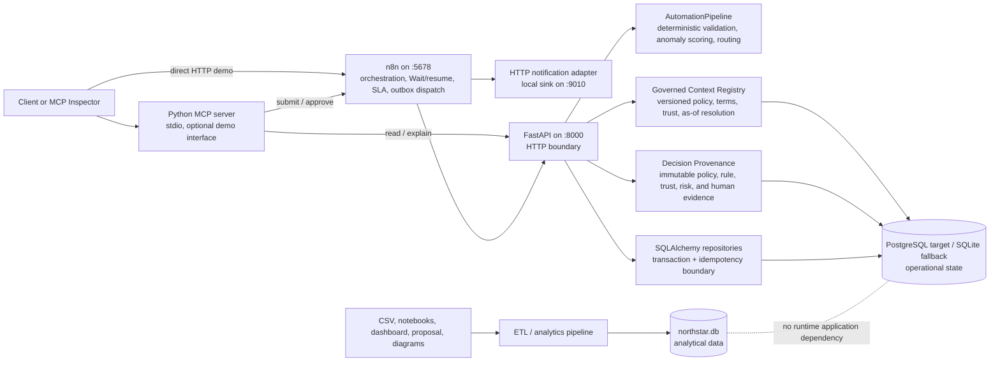

# North Star Current Architecture Baseline

Status: **CURRENT IMPLEMENTED** after Gate 5 verification on 2026-08-13.

This document records the system that exists today. It is not the target v2
architecture. Items under **PLANNED FOR V2** are boundaries only; the detailed
sequence is in `V2_PLAN.md`.

Gate 5 adds no product capability or database migration. A versioned 37-case
deterministic benchmark now release-gates decisions, exact risk signals,
routing, governed-context resolution and abstention, provenance, idempotency,
and selected outbox recovery behavior. FAST and POSTGRES passed 37/37; the
isolated n8n LIVE subset passed 11/11. See `G5_EVALUATION_HARNESS.md`.

## Component diagram



## Ownership and request flows

### Expense submission

1. A caller sends an expense to n8n at `POST /webhook/northstar-expense`.
2. n8n normalizes the webhook body and posts it to
   `http://127.0.0.1:8000/api/expenses/process`.
3. FastAPI validates the body as `ExpenseSubmission`.
4. FastAPI resolves all required governed context at one `context_as_of` and
   binds structured policy parameters to the deterministic execution manifest.
   Missing, conflicted, untrusted, or mismatched context safely abstains with
   HTTP 409 before a financial decision is written.
5. `AutomationPipeline.process_single()` performs deterministic validation,
   anomaly detection, risk classification, approval routing, notification
   payload construction, and structured rule/risk evaluations.
6. The repository atomically writes the materialized expense, workflow run,
   ordered events, pending approval task when required, and the complete
   automated provenance aggregate.
7. The internal n8n service workflow returns a normalized service envelope;
   the public workflow preserves FastAPI's body and status for expected results.

The Python class is historically named `AutomationPipeline`, but its current
responsibility is deterministic domain-step sequencing. n8n owns the external
workflow orchestration and webhook lifecycle.

### Approval decision

1. A caller sends a body shaped as `{expense_id, decision, approver, comment}`
   to n8n at `POST /webhook/northstar-approval`.
2. The Webhook node exposes that payload under `$json.body`.
3. The internal decision workflow privately resolves any registered Wait
   capability, then posts `{decision, approver, comment}` to FastAPI.
4. FastAPI permits only `approve` or `reject`; one repository transaction writes
   immutable decision history, immutable human provenance evidence, task state,
   materialized expense state, and an audit event. The status becomes
   `APPROVED` or `REJECTED`.
5. Only after that commit, the public workflow signals an active n8n Wait. The
   resumed orchestrator fetches persisted truth, completes, and notifies.
6. n8n returns the persisted FastAPI response to the caller. The capability URL
   is never public.

## FastAPI contract

Application factory: `app.main:create_app`. Uvicorn entry point:
`app.main:app`.

| Method and path | Request | Current response |
|---|---|---|
| `GET /health` | None | Exactly `{"status":"ok","service":"northstar"}` |
| `POST /api/expenses/process` | `ExpenseSubmission`; optional `Idempotency-Key`, `X-Correlation-ID` headers | Persisted public expense state; `X-Correlation-ID` response header |
| `GET /api/expenses` | Optional exact `status` query | Newest-first list of public expense states |
| `GET /api/expenses/{expense_id}` | Path ID | Public expense state, or 404 |
| `GET /api/expenses/{expense_id}/explanation` | Path ID | Backwards-compatible deterministic explanation plus provenance ID/hash/verification, or 404 |
| `POST /api/expenses/{expense_id}/decision` | `DecisionRequest` | Updated public expense state, or 404 |
| `GET /api/context/policies...` | Optional UTC `as_of` | Policy identities, versions, effective resolution, rules, owner, and trust |
| `GET /api/context/terms...` | Optional UTC `as_of` | Term identities, versioned definitions, owner, and trust |
| `GET /api/context/owners/{owner_key}` | Path key | Accountable owner, or 404 |
| `GET /api/context/expenses/{expense_id}` | Optional UTC `as_of` | Read-only policy/term context separated from risk-signal definitions |
| `GET /api/provenance/expenses/{expense_id}` | Path ID | Complete immutable evidence aggregate, or 404 |
| `GET /api/provenance/decisions/{provenance_id}` | Path ID | Complete immutable evidence aggregate, or 404 |
| `GET /api/provenance/decisions/{provenance_id}/verify` | Path ID | Recomputed evidence and aggregate hash result |
| `GET /api/provenance/expenses/{expense_id}/trace` | Path ID | End-to-end deterministic decision trace or explicit `LEGACY_UNAVAILABLE` |

`ExpenseSubmission` requires `expense_id`, `employee_id`, `employee_name`,
`department`, `transaction_date`, `merchant`, `category`, and a positive
`amount`. Defaults are `description=""`, `currency="USD"`,
`payment_method="Corporate Card"`, and `receipt_attached=false`. Department,
category, and ISO date format are restricted by the current Pydantic model.
FastAPI/Pydantic input rejection returns HTTP 422.

`DecisionRequest` requires `decision` (`approve` or `reject`) and a non-empty
`approver`; `comment` defaults to an empty string.

A public expense state contains:

- stored fields: `expense_id`, decoded `input_payload`, decoded `result`,
  `status`, `risk_level`, `approver_role`, `decision`, `decided_by`,
  `decision_comment`, `decided_at`, `created_at`, and `updated_at`;
- convenience fields: `anomaly_flags` and `message`.

The stored pipeline `result` contains the deterministic validation, anomaly,
routing decision, notification payload, expense ID, and pipeline status. Current
processing statuses are `AUTO_APPROVED`, `PENDING_APPROVAL`, `ESCALATED`, and,
when the domain pipeline is called directly with invalid data,
`REJECTED_VALIDATION`.

The explanation response retains `expense_id`, `status`, `risk_level`,
`anomaly_flags`, `routing_decision`, `approver`, and `reason`, and adds
`provenance_id`, `provenance_hash`, and `evidence_verified` when available.

## Operational persistence

FastAPI owns operational state through synchronous SQLAlchemy 2.x repositories.
`NORTHSTAR_DATABASE_URL` selects the backend. PostgreSQL through psycopg 3 is the
target durable source of truth; the compatibility default is
`sqlite:///data/northstar_runtime.db`. Tests inject disposable SQLite URLs.

Alembic revision `20260812_0001` creates the original five operational tables.
Revision `20260812_0002` adds orchestration metadata to `approval_tasks` and the
`approval_notifications` table. Revision `20260813_0003` adds
`outbox_events`, append-only `outbox_delivery_attempts`, and sanitized
`workflow_failures`. JSON uses JSONB on PostgreSQL and JSON on
SQLite. Money is `Numeric(18,2)`. Application timestamps are normalized to
aware UTC values.

Revision `20260813_0004` adds the North Star Governed Context Registry:
`governance_owners`, `business_terms`, `business_term_versions`,
`policy_definitions`, `policy_versions`, `policy_rules`, and `trust_signals`.
Governed versions carry deterministic SHA-256 hashes, effective intervals,
certification and review metadata, provenance, ownership, and deterministic
trust aggregation. Gate 4A reads this context but does not alter or annotate
expense decisions.

Revision `20260813_0005` adds `decision_provenance` plus policy, business-term,
rule, trust, risk-signal, and human-decision evidence tables. PostgreSQL uses
JSONB for structured observations and parameters. The application exposes only
append/read operations; relational references and compact immutable snapshots
preserve both navigability and historical meaning. Automated provenance commits
with expense processing, while human evidence commits with approval. The
aggregate hash deliberately covers the automated decision; later human evidence
has its own verified hash and does not rewrite the automated hash.

Processing atomically persists the materialized expense, one workflow run,
ordered audit events, and a pending approval task. Approval atomically persists
immutable decision history, task state, current expense state, run state, and an
event. The domain pipeline has no SQLAlchemy dependency and routes contain no
queries.

Idempotency is enforced using an optional client key or a derived key based on
source, expense ID, and canonical SHA-256 payload hash. Exact replay returns the
existing state without resetting decisions or duplicating runs/tasks. Reused
keys or expense IDs with different payloads return HTTP 409. Optional bounded
correlation IDs are persisted and echoed in response headers; UUIDs are
generated when absent.

An existing Gate 0 `runtime_expenses` table is preserved and copied
idempotently into the new schema for the default SQLite fallback. The standalone
legacy migration command is dry-run by default, reads its source in read-only
mode, and requires `--write` plus a separate target to change anything.

## Analytical persistence and isolation

The separate ETL path owns `data/northstar.db` and reads
`data/expenses.csv`. Its current analytical tables are `dim_categories`,
`dim_departments`, `dim_employees`, and `fact_expenses`. The audited database
contained 10 categories, 6 departments, 120 employees, and 5,000 expenses.

The application and runtime store do not import the ETL module and do not open
`northstar.db`. Conversely, the ETL rebuild targets `northstar.db`, not
`northstar_runtime.db`. A baseline test freezes the distinct database paths.

Important lifecycle distinction: the ETL loader deletes and rebuilds its
analytical database. It must never be pointed at the operational runtime file.
Also, pandas `to_sql(if_exists="replace")` currently replaces the declared
`dim_employees` and `fact_expenses` tables, so the live copies lack the primary
and foreign-key constraints suggested by the earlier schema declarations. This
is analytical technical debt, not a Gate 0 runtime change.

## n8n workflows

Ten inactive, source-controlled workflow exports form the verified control
plane. Public workflows retain the two frozen webhook paths. Review-required
submission claims and starts one non-blocking approval child. The child stores
its execution and Wait capability in PostgreSQL, sends the initial notification,
checks for a terminal race, and waits. The scheduled workflow reserves due SLA
notifications through FastAPI. Internal workflows own HTTP transport and safe
service envelopes.

| File | Kind | Target |
|---|---|---|
| `n8n/workflows/01_expense_intake.json` | Public | `POST /webhook/northstar-expense` |
| `n8n/workflows/02_approval_decision.json` | Public | `POST /webhook/northstar-approval` |
| `n8n/workflows/10_process_expense_service.json` | Internal | `POST /api/expenses/process` |
| `n8n/workflows/11_record_decision_service.json` | Internal | `POST /api/expenses/{expense_id}/decision` |
| `n8n/workflows/20_approval_orchestrator.json` | Internal | Durable Wait/resume lifecycle |
| `n8n/workflows/21_approval_notification_service.json` | Internal | Configurable HTTP notification adapter |
| `n8n/workflows/22_approval_sla_monitor.json` | Scheduled | Reserve and dispatch due notifications |
| `n8n/workflows/23_reliability_dispatcher.json` | Scheduled/internal | Reconcile and lease outbox deliveries |
| `n8n/workflows/24_dead_letter_replay.json` | Internal | Explicit dead-letter replay |
| `n8n/workflows/99_global_error_handler.json` | Error Trigger | Sanitized workflow incident capture |

Each internal `Runtime Configuration` node defines the local API base once as
`http://127.0.0.1:8000`; `$env` remains absent. Expense correlation and
idempotency headers propagate to FastAPI. Expected 200, 409, and 422 statuses
are preserved; FastAPI 5xx, timeout, and connection failures become safe JSON
502 responses. The public response always includes JSON and
`X-Correlation-ID`.

The ten exports were imported, listed, published, and executed using an
isolated n8n 2.22.6 profile. Parent-to-child ID references remained stable. A
waiting execution survived a clean n8n restart using the same isolated state
directory and resumed successfully. Required integration intents now commit in
the same PostgreSQL transaction as decisions and notification reservations.
Workflow 23 provides leased at-least-once recovery, Workflow 24 provides
explicit DLQ replay, and Workflow 99 captures unexpected n8n failures. See
`G3B_RELIABILITY_OUTBOX.md` for crash-window, concurrency, replay, and error
handler evidence.

n8n 2.22.6 returns either HTTP 400 or 409 when an idempotent Wait resume is
already running. The approval and dispatcher workflows accept those statuses
only with the exact safe duplicate-resume message; other failures still enter
the existing retry/dead-letter path.

## MCP status

`mcp_server/server.py` uses the current `mcp.server.MCPServer` API and runs over
stdio by default. The supported development command is
`uv run mcp dev mcp_server/server.py`, which opens MCP Inspector.

Registered tools are:

- `submit_expense`: posts a complete expense to the n8n intake webhook;
- `get_expense_status`: reads one expense from FastAPI;
- `list_pending_approvals`: reads FastAPI and selects `PENDING_APPROVAL` and
  `ESCALATED` records;
- `explain_risk`: reads the deterministic FastAPI explanation;
- `approve_expense`: posts an approval to the n8n approval webhook.

HTTP calls have a ten-second timeout and convert timeout, connection, HTTP
status, HTTP transport, and JSON-decoding failures into explicit error objects.
Safe local defaults use FastAPI port 8000 and n8n port 5678; MCP-specific URLs
can be overridden through `NORTHSTAR_API_BASE_URL`,
`N8N_EXPENSE_WEBHOOK_URL`, and `N8N_APPROVAL_WEBHOOK_URL`.

## Local ports and commands

| Service | Port | Start command |
|---|---:|---|
| FastAPI | 8000 | `.\.venv\Scripts\python.exe -m uvicorn app.main:app --reload --port 8000` |
| n8n | 5678 | `npx.cmd --yes n8n start` |
| Local notification sink | 9010 | `.\.venv\Scripts\python.exe -m uvicorn scripts.notification_sink:app --port 9010` |
| MCP | stdio / Inspector-managed | `.\.venv\Scripts\uv.exe run mcp dev mcp_server/server.py` |

Static and in-process baseline checks:

```powershell
.\.venv\Scripts\python.exe -m compileall -f app automation etl mcp_server scripts tests
.\.venv\Scripts\python.exe -m pytest -q
```

End-to-end test, only after FastAPI and both active n8n workflows are running:

```powershell
.\.venv\Scripts\python.exe scripts\smoke_test.py
```

The smoke test checks health, submits a high-risk expense through n8n, verifies
FastAPI persistence, approves through n8n, verifies final durable `APPROVED`
state, and exits nonzero with a clear service/HTTP/timeout error on failure.

## Current limitations and technical debt

- Local endpoints have no authentication or authorization; approver identity is
  recorded but not verified.
- SQLite remains single-machine compatibility persistence. PostgreSQL 16.14 was
  runtime-verified with migrations, concurrency, rollback, legacy import, real
  HTTP processing/approval, and restart persistence in a disposable container.
- Materially changed reprocessing is deliberately rejected; no explicit future
  reprocessing contract exists yet.
- Internal orchestration endpoints have no authentication and are
  trusted-network-only. Wait resume URLs are sensitive capability URLs.
- External delivery is at-least-once. Real notification providers need native
  idempotency or a deduplicating adapter; exactly-once delivery is not claimed.
- SLA defaults are configurable operational demo timing, not enterprise policy.
- The included notification sink is volatile test/demo infrastructure; no
  external messaging credentials are needed.
- Some source comments and documents contain mojibake from prior encoding
  handling, which can also make legacy Windows-console logging noisy.
- Dependencies are lower-bound ranges without a lockfile. The repository has no
  CI workflow or containerized reproducibility definition.
- The checkout remains nested one directory below the provided workspace root;
  it is now a local Git repository with a Gate 0 baseline commit and no remote.
- Context changes currently use a trusted source-controlled seed; there is no
  authoring UI, RBAC, or interactive certification workflow. Provenance is
  application-append-only rather than protected by database triggers or an
  external transparency log.
- Business-step ownership is obscured by the legacy `AutomationPipeline` name;
  the intended boundary is n8n orchestration versus Python deterministic domain
  logic.

## PLANNED FOR V2 (not implemented)

Evaluations, Metabase, optional governed MCP and voice interfaces, Docker
Compose, and CI remain later work. PostgreSQL persistence, durable HITL,
transactional outbox, leases, DLQ/replay, reconciliation, and global n8n error
handling are runtime-verified. The governed context registry, certified version
history, as-of resolution, trust/freshness, and read-only context API are also
verified.
Immutable decision provenance, safe policy/engine binding, structured rule/risk
evidence, historical snapshots, hash verification, and human-decision linkage
are runtime-verified as well. See `G4B_DECISION_PROVENANCE.md`.
Production authentication, backups, monitoring, and release packaging remain
later-gate concerns.
