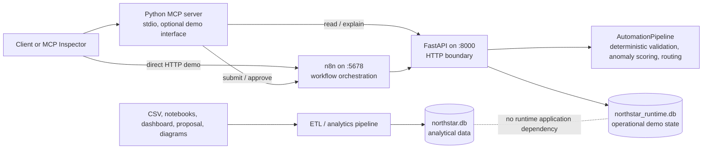

# North Star Current Architecture Baseline

Status: **CURRENT IMPLEMENTED** as audited for Gate 0 on 2026-08-12.

This document records the system that exists today. It is not the target v2
architecture. Items under **PLANNED FOR V2** are boundaries only; the detailed
sequence is in `V2_PLAN.md`.

## Component diagram



## Ownership and request flows

### Expense submission

1. A caller sends an expense to n8n at `POST /webhook/northstar-expense`.
2. n8n normalizes the webhook body and posts it to
   `http://127.0.0.1:8000/api/expenses/process`.
3. FastAPI validates the body as `ExpenseSubmission`.
4. `AutomationPipeline.process_single()` performs deterministic validation,
   anomaly detection, risk classification, approval routing, and notification
   payload construction.
5. FastAPI upserts the input and complete pipeline result into
   `northstar_runtime.db`.
6. n8n branches on the returned status and responds to the original webhook.

The Python class is historically named `AutomationPipeline`, but its current
responsibility is deterministic domain-step sequencing. n8n owns the external
workflow orchestration and webhook lifecycle.

### Approval decision

1. A caller sends a body shaped as `{expense_id, decision, approver, comment}`
   to n8n at `POST /webhook/northstar-approval`.
2. The Webhook node exposes that payload under `$json.body`.
3. The HTTP Request node posts `{decision, approver, comment}` to
   `http://127.0.0.1:8000/api/expenses/{expense_id}/decision`.
4. FastAPI permits only `approve` or `reject`, updates the stored record, and
   returns the full public state. The status becomes `APPROVED` or `REJECTED`.
5. n8n returns that response to the caller.

## FastAPI contract

Application factory: `app.main:create_app`. Uvicorn entry point:
`app.main:app`.

| Method and path | Request | Current response |
|---|---|---|
| `GET /health` | None | Exactly `{"status":"ok","service":"northstar"}` |
| `POST /api/expenses/process` | `ExpenseSubmission` | Persisted public expense state |
| `GET /api/expenses` | Optional exact `status` query | Newest-first list of public expense states |
| `GET /api/expenses/{expense_id}` | Path ID | Public expense state, or 404 |
| `GET /api/expenses/{expense_id}/explanation` | Path ID | Deterministic risk/routing explanation, or 404 |
| `POST /api/expenses/{expense_id}/decision` | `DecisionRequest` | Updated public expense state, or 404 |

`ExpenseSubmission` requires `expense_id`, `employee_id`, `employee_name`,
`department`, `transaction_date`, `merchant`, `category`, and a positive
`amount`. Defaults are `description=""`, `currency="USD"`,
`payment_method="Corporate Card"`, and `receipt_attached=false`. Department,
category, and ISO date format are restricted by the current Pydantic model.
FastAPI/Pydantic input rejection returns HTTP 422.

`DecisionRequest` requires `decision` (`approve` or `reject`) and a non-empty
`approver`; `comment` defaults to an empty string.

A public expense state contains:

- stored fields: `expense_id`, decoded `input_payload`, decoded `result`,
  `status`, `risk_level`, `approver_role`, `decision`, `decided_by`,
  `decision_comment`, `decided_at`, `created_at`, and `updated_at`;
- convenience fields: `anomaly_flags` and `message`.

The stored pipeline `result` contains the deterministic validation, anomaly,
routing decision, notification payload, expense ID, and pipeline status. Current
processing statuses are `AUTO_APPROVED`, `PENDING_APPROVAL`, `ESCALATED`, and,
when the domain pipeline is called directly with invalid data,
`REJECTED_VALIDATION`.

The explanation response contains `expense_id`, `status`, `risk_level`,
`anomaly_flags`, `routing_decision`, `approver`, and `reason`.

## Operational persistence

FastAPI exclusively owns the current operational demo store. The default is
`data/northstar_runtime.db`; `NORTHSTAR_RUNTIME_DB` may override it. Tests inject
temporary paths. Startup creates the parent directory, table, and index when
absent and does not delete the database.

```sql
CREATE TABLE runtime_expenses (
    expense_id TEXT PRIMARY KEY,
    input_payload TEXT NOT NULL,
    result TEXT NOT NULL,
    status TEXT NOT NULL,
    risk_level TEXT,
    approver_role TEXT,
    decision TEXT,
    decided_by TEXT,
    decision_comment TEXT,
    decided_at TEXT,
    created_at TEXT NOT NULL,
    updated_at TEXT NOT NULL
);
CREATE INDEX idx_runtime_status ON runtime_expenses(status);
```

Input and result objects are JSON-encoded in SQLite and decoded on reads.
Reprocessing an existing `expense_id` refreshes its pipeline state and clears
earlier decision metadata. The SQLite connection timeout is five seconds.

At audit time the ignored local runtime database existed and held three demo or
smoke records. It is mutable local state, not a seed or migration artifact.

## Analytical persistence and isolation

The separate ETL path owns `data/northstar.db` and reads
`data/expenses.csv`. Its current analytical tables are `dim_categories`,
`dim_departments`, `dim_employees`, and `fact_expenses`. The audited database
contained 10 categories, 6 departments, 120 employees, and 5,000 expenses.

The application and runtime store do not import the ETL module and do not open
`northstar.db`. Conversely, the ETL rebuild targets `northstar.db`, not
`northstar_runtime.db`. A baseline test freezes the distinct database paths.

Important lifecycle distinction: the ETL loader deletes and rebuilds its
analytical database. It must never be pointed at the operational runtime file.
Also, pandas `to_sql(if_exists="replace")` currently replaces the declared
`dim_employees` and `fact_expenses` tables, so the live copies lack the primary
and foreign-key constraints suggested by the earlier schema declarations. This
is analytical technical debt, not a Gate 0 runtime change.

## n8n workflows

Both checked-in workflows are inactive import artifacts with stable IDs and no
credential-dependent nodes.

| File | Webhook | Nodes | FastAPI target |
|---|---|---|---|
| `n8n/workflows/01_expense_intake.json` | `POST /webhook/northstar-expense` | Webhook, Edit Fields, HTTP Request, Switch, Respond | `POST http://127.0.0.1:8000/api/expenses/process` |
| `n8n/workflows/02_approval_decision.json` | `POST /webhook/northstar-approval` | Webhook, HTTP Request, Respond | `POST http://127.0.0.1:8000/api/expenses/{expense_id}/decision` |

For this frozen local baseline, FastAPI URLs are explicit because the proven
n8n configuration blocked `$env` expressions. A future environment-aware
configuration must not assume localhost. Docker-based n8n requires
`host.docker.internal` or an equivalent service name and a deliberate node
configuration change.

## MCP status

`mcp_server/server.py` uses the current `mcp.server.MCPServer` API and runs over
stdio by default. The supported development command is
`uv run mcp dev mcp_server/server.py`, which opens MCP Inspector.

Registered tools are:

- `submit_expense`: posts a complete expense to the n8n intake webhook;
- `get_expense_status`: reads one expense from FastAPI;
- `list_pending_approvals`: reads FastAPI and selects `PENDING_APPROVAL` and
  `ESCALATED` records;
- `explain_risk`: reads the deterministic FastAPI explanation;
- `approve_expense`: posts an approval to the n8n approval webhook.

HTTP calls have a ten-second timeout and convert timeout, connection, HTTP
status, HTTP transport, and JSON-decoding failures into explicit error objects.
Safe local defaults use FastAPI port 8000 and n8n port 5678; MCP-specific URLs
can be overridden through `NORTHSTAR_API_BASE_URL`,
`N8N_EXPENSE_WEBHOOK_URL`, and `N8N_APPROVAL_WEBHOOK_URL`.

## Local ports and commands

| Service | Port | Start command |
|---|---:|---|
| FastAPI | 8000 | `.\.venv\Scripts\python.exe -m uvicorn app.main:app --reload --port 8000` |
| n8n | 5678 | `npx.cmd --yes n8n` |
| MCP | stdio / Inspector-managed | `.\.venv\Scripts\uv.exe run mcp dev mcp_server/server.py` |

Static and in-process baseline checks:

```powershell
.\.venv\Scripts\python.exe -m compileall -f app automation etl mcp_server scripts tests
.\.venv\Scripts\python.exe -m pytest -q
```

End-to-end test, only after FastAPI and both active n8n workflows are running:

```powershell
.\.venv\Scripts\python.exe scripts\smoke_test.py
```

The smoke test checks health, submits a high-risk expense through n8n, verifies
FastAPI persistence, approves through n8n, verifies final durable `APPROVED`
state, and exits nonzero with a clear service/HTTP/timeout error on failure.

## Current limitations and technical debt

- Local endpoints have no authentication or authorization; approver identity is
  recorded but not verified.
- SQLite is single-machine demo persistence and is not a multi-worker
  operational database.
- Reprocessing the same expense resets decision fields and has no explicit
  idempotency or workflow correlation contract.
- There are no migrations, retry ledger, dead-letter path, SLA timers, or
  transactional workflow outbox.
- Notifications are constructed data only; no external messaging credentials
  are needed.
- Some source comments and documents contain mojibake from prior encoding
  handling, which can also make legacy Windows-console logging noisy.
- Dependencies are lower-bound ranges without a lockfile. The repository has no
  CI workflow or containerized reproducibility definition.
- The checkout is nested one directory below the provided workspace root and is
  not a Git working tree, so commit provenance and tracked/untracked status are
  unavailable.
- Business-step ownership is obscured by the legacy `AutomationPipeline` name;
  the intended boundary is n8n orchestration versus Python deterministic domain
  logic.

## PLANNED FOR V2 (not implemented)

PostgreSQL operational persistence, SQLAlchemy/Alembic, production workflow
reliability, governed context and provenance, evaluations, Metabase, optional
governed MCP and voice interfaces, Docker Compose, and CI are plan items only.
They are intentionally absent from this Gate 0 baseline.
