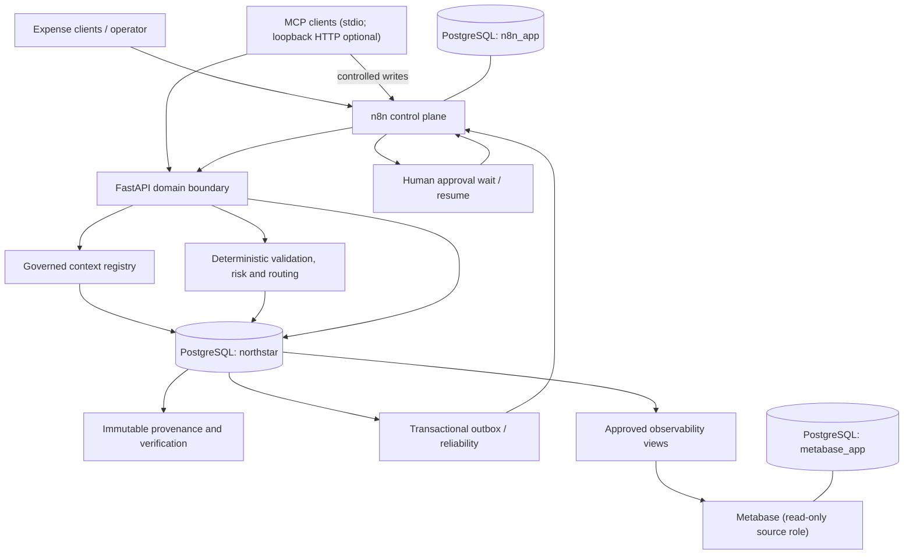

# Final architecture through Gate 9

North Star separates orchestration, deterministic decisions, governed context, durable state, interfaces, and observability so each boundary can be tested independently.

## Paths

- **Write path:** expense input enters an n8n webhook, which invokes FastAPI. The domain layer resolves authoritative context, runs deterministic engines, and commits operational state and provenance to PostgreSQL.
- **Read path:** FastAPI exposes bounded operational, context, explanation, lineage, and provenance views. Direct operational-table access is not a public interface.
- **Approval path:** an escalated expense creates a durable task; n8n registers its Wait execution, the approval webhook records the immutable human decision, and an outbox event resumes the waiting execution.
- **Reliability path:** external-effect intent is committed transactionally. n8n workers claim leased events, record attempts, retry transient failures, and expose dead-letter/replay/reconciliation operations.
- **Context/provenance path:** certified context versions and engine bindings gate decisions. Snapshotted evidence plus references and a canonical hash preserve historical meaning and support verification.
- **MCP path:** MCP read tools call the API; submit/approve tools call normal n8n webhooks. The provider has no direct database or privileged resume capability.
- **Observability path:** Metabase reads only approved `observability.*` views through `northstar_metabase_ro`; its own metadata is stored in `metabase_app`.

## Release topology

Compose creates one private bridge network. API, n8n, Metabase, and an optional debugging PostgreSQL mapping bind only to `127.0.0.1`. One-shot services migrate North Star, seed governed context, create the read-only analytics role, import exactly ten workflows, and reconcile 36 questions/five dashboards before verification.

The release remains a local/demo foundation. Production identity, authorization, TLS, secret management, network policy, backups, and high availability are not claimed.
