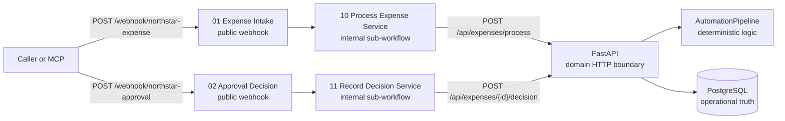

# Gate 2 n8n Control Plane

Status: **IMPLEMENTED AND RUNTIME-VERIFIED** on n8n 2.22.6.

## Boundary and topology

n8n owns integration orchestration: public webhooks, request normalization,
correlation and idempotency headers, service dispatch, and HTTP response
mapping. FastAPI remains the only HTTP domain boundary and owns validation and
state changes. `AutomationPipeline` owns deterministic risk, anomaly, and
routing logic. PostgreSQL remains durable operational truth. No workflow has a
database, credential, Code, command-execution, retry, or MCP node.



The public workflows normalize n8n's webhook envelope, build an orchestration
context, synchronously call a stable-ID internal workflow, map its service
envelope, and respond. The internal workflows accept all parent data, add one
local runtime configuration value, call FastAPI, and return their final Edit
Fields node as the sub-workflow result.

## Source-controlled workflow inventory

| File | Stable ID | Responsibility |
|---|---|---|
| `01_expense_intake.json` | `northstarExpenseIntake` | Public expense webhook |
| `02_approval_decision.json` | `northstarApprovalDecision` | Public approval webhook |
| `10_process_expense_service.json` | `northstarProcessExpenseService` | Internal process API call |
| `11_record_decision_service.json` | `northstarRecordDecisionService` | Internal decision API call |

The public Execute Sub-workflow nodes use the imported stable string IDs in
resource-locator `id` mode. A clean n8n 2.22.6 profile imported all four files,
listed the same four IDs, published them, and executed both parent-to-child
paths. This proves the checked-in references are portable for the tested
version. Import remains the runtime schema authority; the repository validator
intentionally checks contracts rather than attempting to recreate n8n's full
schema.

## Request context

Expense intake preserves a supplied `X-Correlation-ID`; otherwise it creates
`northstar-n8n-<execution_id>`. That value is sent to FastAPI and returned in
the public response header. A supplied `Idempotency-Key` is preserved;
otherwise the stable integration key is
`northstar:n8n:expense:<expense_id>`. FastAPI's canonical payload hash remains
authoritative for replay and conflict detection.

Approval intake extracts only `expense_id`, `decision`, `approver`, and
`comment`. Its correlation value follows the same preserve-or-generate rule and
is returned by n8n. FastAPI continues to own duplicate and conflicting decision
semantics.

## Runtime configuration

Each internal workflow has one `Runtime Configuration` Edit Fields node. Its
source-controlled local value is `http://127.0.0.1:8000`; every HTTP URL derives
from `api_base_url`. There are no `$env` expressions and n8n security settings
do not need to be weakened. Later container packaging changes only that node's
value to an internal service URL such as `http://api:8000`.

## Service and public response mapping

Internal workflows return `ok`, `status_code`, `correlation_id`, `data`, and
`error`. Public success and expected-domain responses return FastAPI's body,
not the internal envelope.

| FastAPI/transport result | Public n8n result |
|---|---|
| HTTP 200 | HTTP 200 and FastAPI JSON body |
| HTTP 409 | HTTP 409 and FastAPI JSON error body |
| HTTP 422 | HTTP 422 and FastAPI validation body |
| Any FastAPI 5xx | HTTP 502 and safe generic JSON |
| Timeout/connection failure | HTTP 502 and safe generic JSON |

Both internal HTTP nodes use a 5,000 ms response-header timeout, full response
metadata, `neverError` for HTTP status mapping, and controlled regular output
for transport errors. There are deliberately no retries. Every public response
uses a Respond to Webhook node with a dynamic status, non-empty JSON body,
`Content-Type: application/json`, and `X-Correlation-ID`.

## Local import and start

From Windows PowerShell in the repository root:

```powershell
.\.venv\Scripts\python.exe scripts\validate_n8n_workflows.py
npx.cmd --yes n8n import:workflow --separate --input="n8n\workflows"
npx.cmd --yes n8n publish:workflow --id=northstarProcessExpenseService
npx.cmd --yes n8n publish:workflow --id=northstarRecordDecisionService
npx.cmd --yes n8n publish:workflow --id=northstarExpenseIntake
npx.cmd --yes n8n publish:workflow --id=northstarApprovalDecision
npx.cmd --yes n8n start
```

Import/publish operations should be done while n8n is stopped; start it after
publishing. The two public production paths remain
`/webhook/northstar-expense` and `/webhook/northstar-approval`.

## Verified release matrix

An isolated n8n 2.22.6 user folder, disposable PostgreSQL 16 container, and
temporary FastAPI process were used. Verification passed for four-workflow
import/list/publish, parent-to-child execution, the unchanged smoke test,
non-empty expense and approval responses, supplied and generated correlation,
explicit and generated idempotency replay, changed-payload 409, invalid-payload
422, approval, identical duplicate approval, conflicting approval 409, and
FastAPI-down 502.

Database evidence for the focused runtime test was:

| Expense | Correlation | Runs | Tasks | Linked events | State |
|---|---|---:|---:|---:|---|
| supplied context | `g2-correlation-cb46e187b642` | 1 | 1 | 6 | `APPROVED` |
| generated context | `northstar-n8n-13` | 1 | 1 | 5 | `ESCALATED` |

The generated run stored the exact key
`northstar:n8n:expense:G2-GENERATED-cb46e187b642`. Replays and the changed
payload produced no extra workflow run or task. All event rows were joined to
the single run ID. This query was performed as release-test evidence outside
n8n; the workflows themselves never access PostgreSQL.

With FastAPI stopped, the public expense webhook returned HTTP 502, correlation
`g2-fastapi-down-proof`, and exactly a safe generic error plus correlation ID.
It did not hang, return an empty 200, or expose an exception.

## Known limitations and deferred work

Workflow activation is a local deployment step; inactive exports are safer for
source control. Runtime API base configuration is intentionally node-local
because `$env` is blocked in the proven profile. Visual verification was
structural from unique node positions and clean left-to-right connections, not
a claimed manual editor review.

Retries, error-trigger workflows, dead-letter handling, durable human waits,
notifications, SLA timers, authentication, authorization, outbox delivery,
container packaging, and production monitoring are deferred. They are not Gate
2 capabilities.
