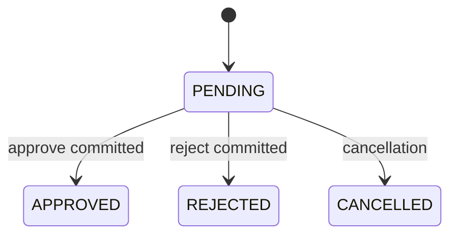
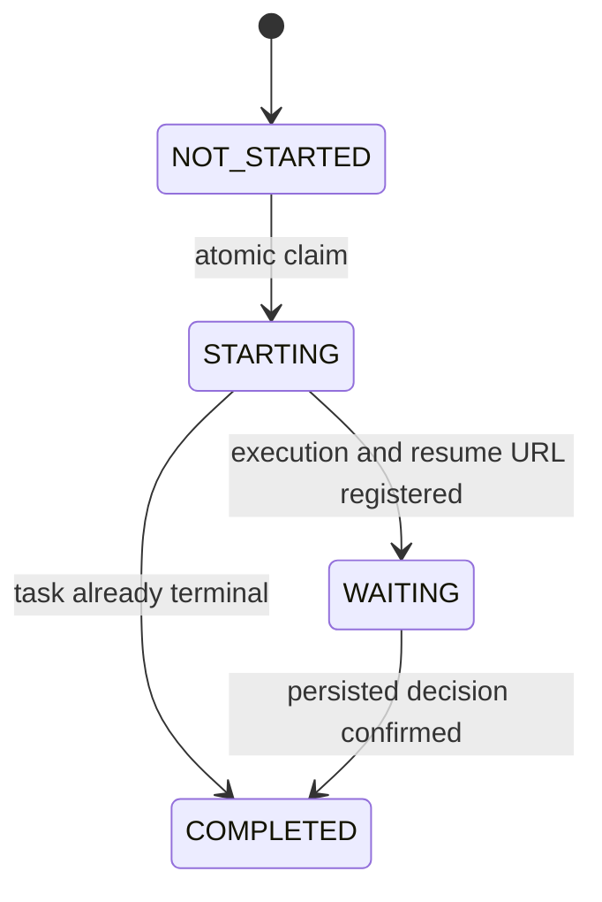

# Gate 3A Durable HITL and Approval SLA

Status: **IMPLEMENTED AND RUNTIME-VERIFIED** on n8n 2.22.6 and PostgreSQL 16.

## Architecture and authority

```mermaid
flowchart LR
    Client["Public caller or MCP"]
    Intake["01 Expense Intake"]
    Process["10 Process Expense Service"]
    Orchestrator["20 Approval Orchestrator"]
    Wait["n8n Wait\nwebhook resume"]
    Decision["02 Approval Decision"]
    Record["11 Record Decision Service"]
    Notify["21 Notification Service"]
    SLA["22 SLA Monitor"]
    API["FastAPI internal and public APIs"]
    DB[("PostgreSQL\noperational truth")]
    Sink["Configurable HTTP sink"]

    Client --> Intake --> Process --> API --> DB
    Process -->|"review required; non-blocking launch"| Orchestrator
    Orchestrator --> API
    Orchestrator --> Notify --> Sink
    Orchestrator --> Wait
    Client --> Decision --> Record --> API --> DB
    Decision -->|"internal capability URL"| Wait
    Wait --> Orchestrator
    Orchestrator --> API
    SLA --> API
    SLA --> Notify
```

n8n owns workflow lifecycle, scheduling, waiting, resumption, and adapter
dispatch. FastAPI owns the API and repository boundary. The deterministic
`AutomationPipeline` owns expense decisions. PostgreSQL owns approval,
decision, orchestration, and notification state. A lost n8n execution cannot
undo or change a committed financial decision.

## State machines

Approval state and orchestration state are deliberately separate:

The database enforces one decision per approval task, one n8n execution ID per
task, and one logical notification per
`(approval_task_id, notification_type, escalation_level)`.

## n8n 2.22.6 behavior used

The implementation was built from the locally installed 2.22.6 node schemas
and runtime source, then exercised in an isolated profile.

- The Wait node is type version 1.1 with `resume=webhook`, `httpMethod=POST`,
  and `responseMode=onReceived`.
- `$execution.resumeUrl` is available inside the running execution. The
  registered URL contains the waiting execution ID and a generated signature.
- Waiting executions are persisted in n8n's database with status `waiting` and
  are reloaded by the waiting-webhook handler.
- The handler validates the resume token and execution state before continuing;
  a finished or already-running execution is not resumed as a second logical
  execution.
- Expense intake launches the orchestrator through Execute Sub-workflow 1.3
  with `waitForSubWorkflow=false`. The public submission therefore returns
  while the child continues under its own execution ID.
- Stable imported workflow IDs are used for every sub-workflow reference.
- Schedule Trigger 1.3 starts the SLA monitor. Split Out 1.0 emits each reserved
  notification to the notification adapter.

## Registration, resume, and race handling

The process service calls an atomic claim endpoint after FastAPI reports a
review-required result. Only the transaction that changes `NOT_STARTED` to
`STARTING` receives `launch_required=true`; replays do not start another
orchestrator.

The orchestrator registers its execution ID and `$execution.resumeUrl` through
an internal endpoint. Registration is idempotent for the same execution and
returns HTTP 409 for a different owner. Immediately before Wait, it reads the
task again. If the task is already `APPROVED`, `REJECTED`, or `CANCELLED`, it
skips Wait and completes.

The public approval flow first resolves the internal orchestration record, then
commits the decision through FastAPI, and only then POSTs to the resume URL.
The public response is always the persisted FastAPI expense result. If resume
delivery fails, the financial state remains correct; delivery reconciliation is
deferred to Gate 3B.

For the registration race, a terminal task registered by the delayed child is
recorded as `COMPLETED` and `should_wait=false`. This uses database state, not a
production sleep. The delay environment variable exists only as a bounded test
hook (`NORTHSTAR_TEST_ORCHESTRATION_REGISTRATION_DELAY_MS`, default `0`).

## SLA and notification lifecycle

`ApprovalSLAService` assigns `approval_tasks.due_at` when a review task is
created. Defaults are operational demo timing, not financial policy:

| Risk | Default | Override |
|---|---:|---|
| CRITICAL | 4 hours | `NORTHSTAR_APPROVAL_SLA_CRITICAL_SECONDS` |
| HIGH | 8 hours | `NORTHSTAR_APPROVAL_SLA_HIGH_SECONDS` |
| MEDIUM | 24 hours | `NORTHSTAR_APPROVAL_SLA_MEDIUM_SECONDS` |
| LOW | 48 hours | `NORTHSTAR_APPROVAL_SLA_LOW_SECONDS` |

Notifications are deterministic: initial at orchestration start, reminder at
50% of the SLA window, overdue at 100%, escalation level 1 at 150%, and a
completion notification after terminal state is confirmed. The scheduler asks
FastAPI to reserve due notifications; the uniqueness constraint prevents a
repeated schedule run from creating a notification storm. The adapter sends a
safe payload to the single configured HTTP sink and then marks that reservation
sent. `scripts/notification_sink.py` is only in-memory demo/test infrastructure.

## Resume URL security

The resume URL is a capability URL. It is stored only in the internal
orchestration record, omitted from all public expense and decision responses,
omitted from notification payloads, and not printed by ordinary application
logging. The `/api/internal/...` endpoints have no authentication in this gate
and must be reachable only on a trusted local/private network. Encryption,
credential management, and RBAC are intentionally deferred.

## Runtime evidence

The release run used a disposable PostgreSQL 16 container, FastAPI backed by
that database, an isolated n8n 2.22.6 user folder, and the local notification
sink.

- `G3A-LIVE-001` returned `ESCALATED` in 233 ms, registered n8n execution `4`,
  reached `WAITING`, emitted one initial notification, approved through the
  unchanged public webhook, resumed, emitted completion, and ended with
  orchestration `COMPLETED`.
- `G3A-RESTART-001` persisted n8n execution `14` as `waiting`. n8n was stopped
  cleanly and restarted with the same isolated state directory; the execution
  still existed, resumed through the public approval webhook, and finished
  `success` while PostgreSQL ended `APPROVED` / `COMPLETED`.
- `G3A-RACE-LIVE-001` was approved while orchestration remained `STARTING` and
  had no registered execution. Delayed registration then observed the terminal
  task, stored execution `37`, skipped Wait, and finished without a permanent
  waiting execution or duplicate decision.
- With CRITICAL SLA overridden to 20 seconds, `G3A-SLA-LIVE-001` emitted exactly
  one each of `APPROVAL_REQUEST`, `REMINDER`, `OVERDUE`, and `ESCALATION`.
  PostgreSQL recorded `reminder_count=1` and `escalation_level=1`.
- Migration `20260812_0002` passed PostgreSQL upgrade from `0001`, downgrade one
  revision, re-upgrade, and `alembic check` without destructive data setup.

## Known limitations

- Internal endpoints are trusted-network-only and unauthenticated.
- Gate 3A does not retry a failed resume or notification delivery.
- Notification reservation is not a transactional outbox.
- n8n activation/import and runtime configuration remain deployment steps.
- The local sink is volatile and must not be treated as production state.
- Global error handling, DLQ, replay, reconciliation, and monitoring belong to
  Gate 3B and are not implemented here.
