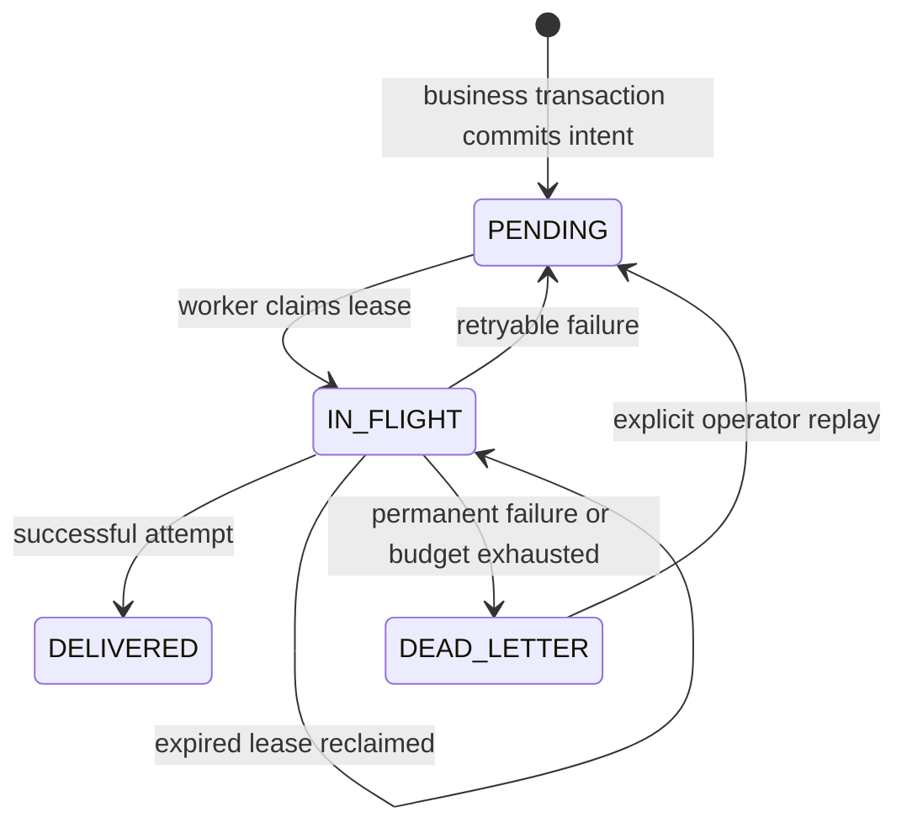
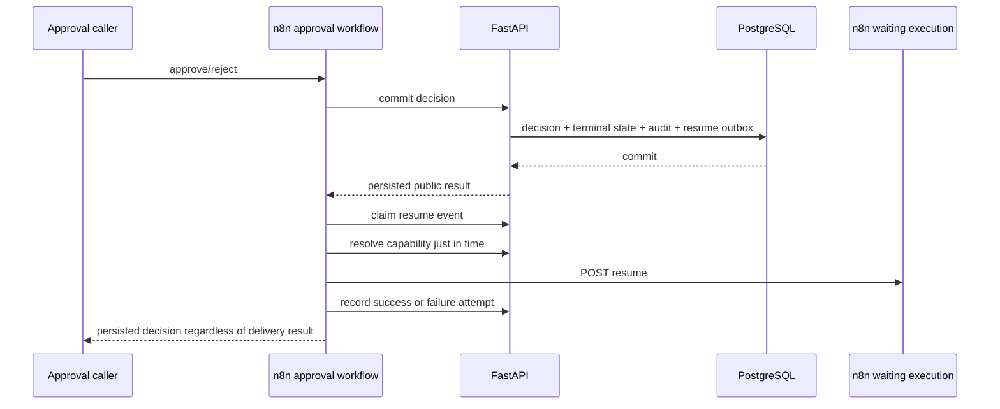
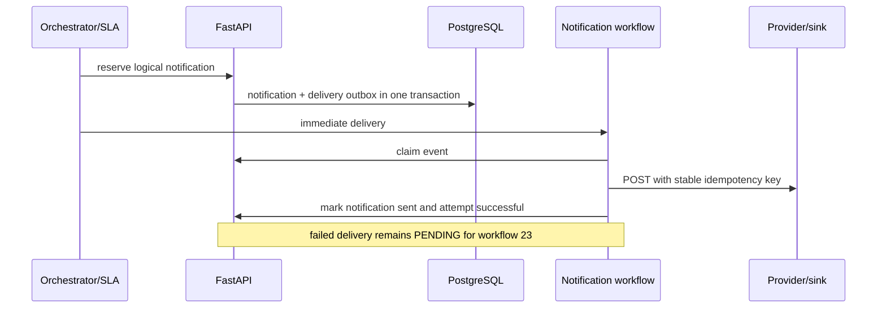

# Gate 3B Transactional Outbox and Workflow Recovery

Status: **IMPLEMENTED AND RUNTIME-VERIFIED** with PostgreSQL 16 and n8n 2.22.6.

## Original failure windows

Gate 3A correctly committed financial state before workflow coordination, but
four delivery windows remained:

1. A decision could commit and the approval webhook process could stop before
   POSTing the n8n Wait capability.
2. An approval notification could commit and its n8n execution could stop
   before calling the notification adapter.
3. An SLA reservation could commit while the provider was unavailable.
4. Completion state could commit while its completion notification was lost.

In each case PostgreSQL retained the business record, but there was no durable,
independently claimable delivery record. Gate 3B closes those windows by
creating the corresponding outbox row in the same transaction.

## Reliability model

The guarantee is transactional intent plus **at-least-once delivery**, not
exactly-once external delivery. A worker may deliver an effect and lose its
acknowledgement. Notification calls therefore carry the stable header
`Idempotency-Key: northstar:notification:<notification_id>`. The local sink
proves logical deduplication. A real provider must offer equivalent idempotency
or be wrapped by a deduplicating adapter.

Only two event types exist:

- `APPROVAL_RESUME_REQUIRED`
- `NOTIFICATION_DELIVERY_REQUIRED`

Resume capability URLs never appear in outbox payloads. They are resolved from
the internal approval task immediately before delivery.

## Tables and attempt model

`outbox_events` stores event/aggregate identity, unique `delivery_key`, safe
identifier payload, correlation ID, status, current retry budget, due time,
lease ownership, last sanitized error, delivery/dead-letter timestamps, and
replay count. Compound due and aggregate indexes support dispatch and operator
inspection.

`outbox_delivery_attempts` is append-only. Its unique
`(outbox_event_id, attempt_number)` constraint preserves a monotonic history
across replay. Replaying resets the current retry budget but never deletes or
renumbers old attempts.

`workflow_failures` stores idempotent operational incidents keyed by workflow
and execution. Only bounded failure metadata is stored; request bodies,
credentials, resume URLs, DSNs, SQL, and stack traces are excluded.

## Lease and retry policy

PostgreSQL claiming uses `SELECT ... FOR UPDATE SKIP LOCKED`. A claim changes a
due `PENDING` row to `IN_FLIGHT` and records worker and lease timestamps in the
same transaction. An `IN_FLIGHT` row whose lease expired is eligible again, so
a dead worker cannot strand the event. SQLite preserves functional semantics;
the multi-worker guarantee is PostgreSQL-specific.

Defaults are four attempts with delays `0, 15, 60, 300` seconds and a 30-second
lease. They are configured by `NORTHSTAR_OUTBOX_RETRY_SECONDS`,
`NORTHSTAR_OUTBOX_MAX_ATTEMPTS`, and `NORTHSTAR_OUTBOX_LEASE_SECONDS`.
Connection errors, timeouts, 408, 425, 429, and 5xx are retryable. Most 4xx are
permanent. One n8n-specific exception is based on observed 2.22.6 behavior: a
successful Wait wake-up may return HTTP 400 with `is running already`; that
exact condition is treated as an idempotently accepted resume.

## Delivery sequences

Workflow 23 reconciles first, claims due events, resolves resume targets or
invokes Workflow 21, and reports every completed attempt. Workflow 24 is an
internal Execute Sub-workflow-only operator action: it reuses the dead-letter
row, increments `replay_count`, preserves history, and invokes Workflow 23.

## Reconciliation and global errors

Reconciliation idempotently repairs a terminal approval task missing its resume
intent and an unsent notification missing its delivery intent. Unique delivery
keys make repeated runs harmless. It is a safety net, not the normal path.

Workflow 99 uses the actual Error Trigger and is assigned through each other
North Star workflow's `settings.errorWorkflow`. It normalizes the n8n error
envelope and posts only safe metadata to FastAPI. It does not reference itself.
When FastAPI is down, its HTTP node returns controlled output and the handler
finishes successfully; n8n execution history is the only evidence for that
window, avoiding a recursive error storm.

## Runtime evidence

- Normal HITL: suspicious submission reached Wait, approval returned
  `APPROVED`, the execution completed, and resume plus notification events were
  `DELIVERED` with one successful attempt each.
- Resume crash window: the stored capability was temporarily made unreachable.
  Public approval still returned and persisted `APPROVED`; the outbox recorded
  `RETRYABLE_FAILURE / CONNECTION_ERROR`. After restoring the capability,
  Workflow 23 delivered attempt 2 and orchestration completed.
- Notification crash window: the sink was stopped before initial delivery. The
  notification and outbox committed, attempt 1 failed, and after restart attempt
  2 succeeded. The sink contained one logical notification.
- Poison/DLQ: an unavailable sink produced four immutable retryable attempts,
  then `DEAD_LETTER`; no fifth automatic attempt occurred.
- Manual replay: Workflow 24 reused the same event, incremented replay count,
  retained all four failures, and added attempt 5 `SUCCESS`. The idempotent sink
  still contained one logical notification.
- Lease recovery: worker B could not claim before worker A's expiry and could
  claim/deliver afterward.
- Multi-worker: two PostgreSQL workers claimed three of six events each with
  disjoint ownership under `SKIP LOCKED`.
- Error Trigger: controlled execution `159` failed, Workflow 99 execution `160`
  succeeded, and exactly one sanitized `workflow_failures` row was stored.
  With FastAPI stopped, one additional handler execution completed successfully
  and no recursive handler execution occurred.
- Gate 3A durability remained intact: waiting execution `39` survived an n8n
  restart and subsequently completed `success`.

## Known limitations

- Internal reliability APIs remain unauthenticated and trusted-network-only.
- Notification idempotency ultimately depends on provider support or an adapter.
- The scheduler is polling-based; no broker or push wake-up is introduced.
- If FastAPI is unavailable, Workflow 99 cannot persist its incident and relies
  on n8n history.
- Operator UI, RBAC, alerting, dashboards, and Metabase are later gates.
