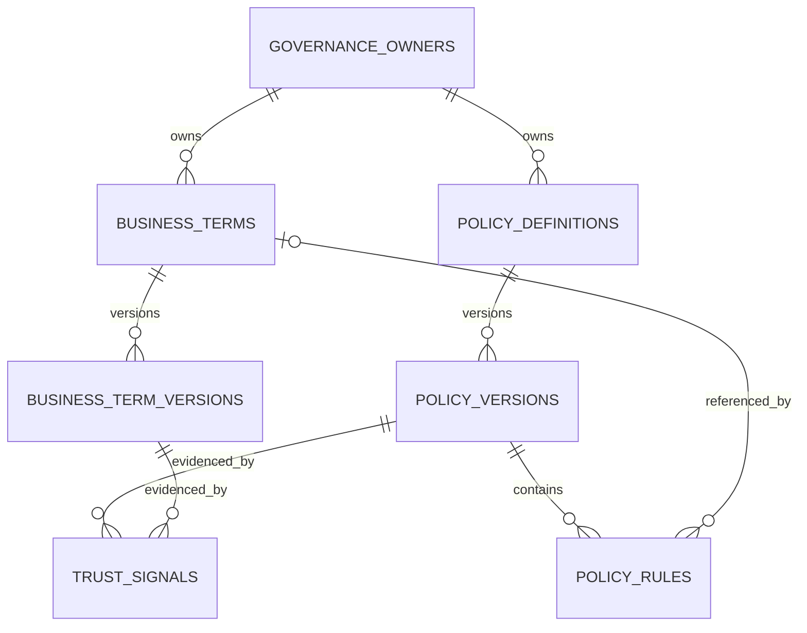

# Gate 4A Governed Context Registry

Status: **IMPLEMENTED AND VERIFIED** with PostgreSQL 16.14, SQLite, FastAPI,
n8n 2.22.6, and the official Python MCP SDK 2.0.0.

## Problem statement and design

North Star previously contained deterministic business rules and risk-engine
heuristics only in processing code. That code could execute consistently, but
could not answer who owned a definition, which certified version applied at an
arbitrary time, whether it remained current, or where it originated. The North
Star Governed Context Registry provides those semantics without becoming a
prompt store and without changing expense decisions in Gate 4A.

PostgreSQL remains the authoritative datastore, with SQLite compatibility for
local demos and tests. Stable identities are separate from versioned governed
content. Writes occur only through the source-controlled seed and trusted
repository/service code; the HTTP API is read-only.

## Rule inventory and classification

The current source was inventoried before choosing seed content.

| Classification | Current implementation | Registry treatment |
|---|---|---|
| Business policy | Ten category spending limits; receipt warning above 75; detailed-description warning above 500; rejection of future transaction dates | `EXPENSE_SUBMISSION_REQUIREMENTS` |
| Business policy | Amount routing tiers at 500, 2,000, and 5,000; high/critical risk response; medium-risk human review; review when anomalous or above 2,000 | `EXPENSE_APPROVAL_ROUTING` |
| Algorithmic risk signal | Category z-score above 2.5; weekend date; round amount above 500; missing receipt above 200; `DUPLICATE` description marker; risk-score bands | Source-controlled `context/risk_signals.json`, not policy rules |
| Implementation/transport | HTTP timeouts, n8n webhooks/Wait, SLA timing, outbox attempts/backoff/leases, notification formatting and delivery | Excluded from the registry |

The receipt distinction is deliberate: “receipt required above 75” is a
business warning, while “missing receipt above 200 adds 0.25 risk” is an
algorithmic signal. Gate 4A exposes that difference explicitly.

## Entity model

`governance_owners`, `business_terms`, and `policy_definitions` hold stable
identity. `business_term_versions` and `policy_versions` hold effective-time,
certification, source, review, and SHA-256 identity. `policy_rules` contains
structured JSON parameters rather than executable code or prompts.
`trust_signals` uses real nullable foreign keys plus a check constraint that
requires exactly one version target.

PostgreSQL stores policy metadata, rule parameters, and trust details as JSONB.
Unique constraints cover owner, term, and policy keys; version number within a
stable identity; and rule key within a policy version.

## Version lifecycle and certification

Version statuses are `DRAFT`, `CERTIFIED`, and `RETIRED`. Certified substantive
content is immutable through the repository boundary. Definition, effective
window, metadata, rules, source, and content-hash inputs cannot be rewritten.
A changed definition or rule set requires a new version number. Retirement may
change lifecycle status but does not erase history or its content hash.

Service validation rejects an effective end or review date before the effective
start. It also rejects overlapping certified effective windows for the same
identity. Resolution defensively raises a context conflict if deliberately
corrupt data still produces multiple certified candidates.

Effective intervals are half-open: `effective_from <= as_of < effective_to`,
with a null end meaning open-ended.

## Content hashing

SHA-256 is computed over compact, key-sorted canonical JSON. Datetimes are
normalized to UTC, nested object key order is irrelevant, and policy rules are
ordered by `rule_key`. Volatile database timestamps are excluded. Policy
hashes cover effective/review/source metadata and the complete governed rule
content; term hashes cover the versioned definition and its governed interval
and source. Tests prove reordered JSON/rules retain a hash and substantive
changes produce a different hash.

## Ownership and trust/freshness

The initial accountable owner is the active `FINANCE_COMPLIANCE` team,
displayed as “Finance Compliance.” No personal identity or fabricated email is
seeded.

Resolution aggregates these states deterministically:

- `TRUSTED`: certified and effective, owner active, required certification,
  freshness, ownership, and source-verification signals all currently pass,
  and review is not overdue.
- `STALE`: the version still resolves, but review is overdue or the required
  freshness signal expired.
- `UNVERIFIED`: a version exists but is not certified, its owner is inactive,
  or required evidence is missing/not passing.
- `CONFLICTED`: multiple certified versions resolve or any applicable trust
  signal explicitly fails.
- `MISSING`: the stable identity exists but no version applies at `as_of`.

Expired non-freshness evidence also prevents `TRUSTED` and is reported in the
reason list. Stale context is returned rather than hidden.

## Seed strategy

`context/registry.seed.json` is the human-readable governed source. The seed
contains one team owner, three focused business terms, two policies, eight
rules, five governed versions, and four trust signals per version.

`scripts/seed_context_registry.py` previews by default and writes only with
`--write`. Stable UUIDs are deterministic. A repeat write is idempotent. If the
same certified version number hashes differently, the script fails with
`requires-new-version` semantics and does not overwrite history. It never
deletes prior governed content. Certification-state or trust-evidence drift is
also reported as a conflict rather than silently accepted.

## Read-only API

- `GET /api/context/policies`
- `GET /api/context/policies/{policy_key}`
- `GET /api/context/policies/{policy_key}/versions`
- `GET /api/context/policies/{policy_key}/resolve?as_of=...`
- `GET /api/context/terms`
- `GET /api/context/terms/{term_key}`
- `GET /api/context/terms/{term_key}/versions`
- `GET /api/context/terms/{term_key}/resolve?as_of=...`
- `GET /api/context/owners/{owner_key}`
- `GET /api/context/expenses/{expense_id}?as_of=...`

Responses use explicit Pydantic models and UTC timestamps. Missing stable
identities return 404; conflicting resolution returns 409. No mutation routes,
outbox internals, resume capabilities, credentials, or secrets are exposed.

Expense context returns policy context and business terms separately from
algorithmic risk-signal definitions, including which catalog signals match the
stored expense flags. It reports `decision_behavior_changed: false`.

## Historical and live verification

A disposable policy with adjacent version-1 and version-2 windows resolved v1
during period A, v2 during period B, and `MISSING` before both. Both historical
rows remained readable. The same behavior was verified for business terms.

The live seeded routing policy resolved as follows:

| `as_of` | Version | Trust |
|---|---:|---|
| Current Gate 4A runtime | 1 | `TRUSTED` |
| 2025-06-01 | 1 | `TRUSTED` |
| 2031-01-01 | 1 | `STALE` (review overdue and freshness expired) |

A live suspicious expense remained `ESCALATED / CRITICAL / Finance Director +
Compliance`. Its context response contained two policies, three terms, five
observed risk definitions, all five governed versions trusted at submission
time, and no decision behavior change.

## PostgreSQL verification

PostgreSQL 16.14 passed `0003 -> 0004 -> 0003 -> 0004`. A pre-existing Gate 3B
`workflow_failures` row survived the full cycle. Alembic autogeneration found no
drift. JSONB types and named version/trust constraints were inspected directly.
The seed preview reported 31 creations, first write created 31 records, and a
repeat write reported 31 unchanged records. SQLite and PostgreSQL full suites,
the clean ten-workflow n8n import, the unchanged end-to-end smoke test, and the
five-tool MCP registration all passed.

## Limitations and Gate 4B boundary

Gate 4A does not yet persist context on decisions, snapshot resolved context,
or attach rule evidence to workflow events. It has no authoring UI, generic CRUD
API, RBAC, approval workflow for certification, database exclusion constraint
for effective ranges, or automated source-review process. The seed is the
trusted change path for this gate.

Gate 4B may add decision provenance referencing the stable version IDs and
content hashes created here. It must decide snapshot/reference semantics,
persist resolution time and evidence, and integrate context without rewriting
historical decisions. Gate 4B was not started.
