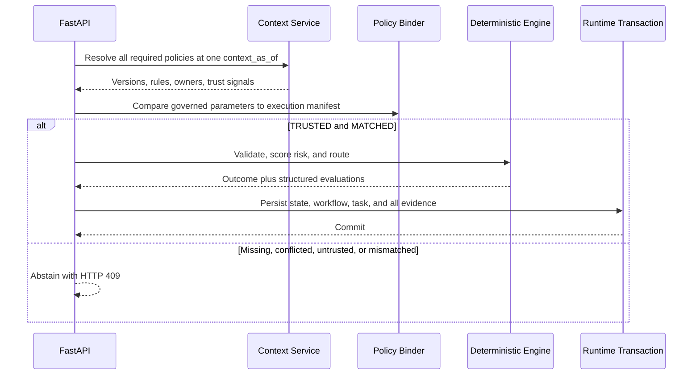
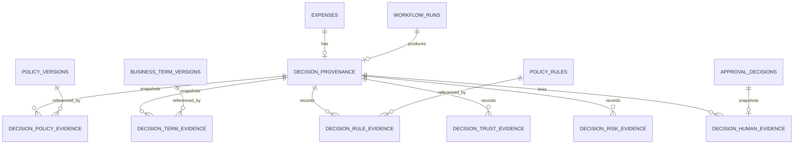

# Gate 4B Immutable Decision Provenance

## Why provenance is required

An expense outcome is not auditable merely because a result string survives.
North Star must retain the exact input hash, workflow identity, governed policy
versions, definitions, trust evidence, evaluated business rules, evaluated risk
signals, automated outcome, and any later human decision. Gate 4B persists that
evidence deterministically. It does not use an LLM and it does not parse prose
warnings to reconstruct decisions.

## Reference plus snapshot model

Evidence rows retain foreign-key references to governed policy, term, rule, and
trust identities for navigation. Compact snapshots retain the decision-relevant
keys, version numbers, parameters, owners, effective windows, trust state, and
content hashes. References show where context lives; snapshots keep an old
decision understandable when the registry later advances to another version or
trust evidence changes.

## Context before decision



The context timestamp is also the workflow run's `started_at`. Transaction date
remains separately visible in the input trace and is not used as the policy
resolution time.

## Policy execution manifest and binding

`automation/policy_manifest.py` is the deterministic business-policy
configuration executed by Python. The validator and router import its category
limits, receipt/description thresholds, review threshold, and approval tiers.
`app/context/binding.py` compares stable policy/rule keys and structured
parameters against the resolved Gate 4A registry.

Numbers are canonicalized so `3000` and `3000.0` match. Prose is not compared.
Additional unrelated governed rules do not change the binding, but every rule
required by the engine must exist and match. Outcomes are `MATCHED`, `MISSING`,
`MISMATCH`, `CONFLICTED`, or `UNTRUSTED`.

## Context safety and abstention

Only `TRUSTED + MATCHED` proceeds. Missing policies, overlapping authoritative
versions, stale/unverified context, inactive ownership, failed trust evidence,
or parameter drift cause deterministic abstention. FastAPI returns HTTP 409 with
`CONTEXT_NOT_AUTHORITATIVE`, a safe reason code, and the correlation ID. No
expense, workflow run, approval task, or successful provenance row is written.

Reason codes are `POLICY_MISSING`, `POLICY_CONFLICT`, `POLICY_UNTRUSTED`, and
`POLICY_ENGINE_MISMATCH`. PostgreSQL registry provisioning is explicit; request
handling never auto-seeds certified context. SQLite auto-provisioning is limited
to the development/test fallback and uses the same source-controlled seed.

## Policy evidence versus risk evidence

Business-policy evaluations originate inside `ExpenseValidator` and
`ApprovalRouter`. They record `PASSED`, `FAILED`, `TRIGGERED`, or
`NOT_APPLICABLE`, an observed value, and structured details. Algorithmic risk
evidence originates inside `AnomalyDetector` and remains separate. Every risk
signal actually evaluated is represented, including non-triggered signals.

The risk catalog and each signal definition receive canonical SHA-256 hashes.
The catalog is descriptive evidence for the deterministic risk engine, not a
business-policy registry.

## Entity model



The seven Gate 4B tables are append-only at the application boundary. Important
query dimensions remain relational: outcome, risk, approver, trust state,
policy/version, rule, triggered signal, and human decision.

## Human decision linkage and atomicity

The existing immutable `approval_decisions` record remains authoritative. When
an automated provenance row exists, its compact human snapshot is inserted in
the same transaction as the decision, task update, expense state, workflow
event, and outbox resume intent. Legacy approvals without Gate 4B provenance
continue safely without fabricated evidence.

Automated processing likewise commits the expense, workflow run/events,
approval task, provenance header, and policy/term/rule/trust/risk evidence in
one transaction. Injected evidence failures roll the entire transaction back.

## Hashing and engine versions

Evidence hashes reuse Gate 4A canonical JSON and SHA-256 utilities. The overall
provenance hash includes the payload hash, workflow/correlation identity,
context time, sorted evidence hashes, automated outcome, catalog hash, and
engine versions. Volatile database row IDs and creation timestamps are omitted.
The verifier recomputes every evidence hash and the aggregate hash.

Semantic engine identifiers are:

- `northstar-expense-decision/1.0.0`
- `northstar-anomaly-risk/1.0.0`

`NORTHSTAR_BUILD_REVISION` may record a deployment build identifier; it is null
when not supplied and Git is never invoked during requests.

## Historical reproducibility and legacy data

A decision made under policy version 1 continues to expose version 1, its old
content hash, owner/trust snapshot, rules, and parameters after the current
registry advances to version 2. Later trust changes do not rewrite the stored
trust evidence. Exact request replay returns the existing outcome and hash
without duplicate evidence.

Pre-Gate-4B expenses are not backfilled with invented details. Their trace says
`LEGACY_UNAVAILABLE` and preserves the existing final state.

## Read-only API

- `GET /api/provenance/expenses/{expense_id}`
- `GET /api/provenance/decisions/{provenance_id}`
- `GET /api/provenance/decisions/{provenance_id}/verify`
- `GET /api/provenance/expenses/{expense_id}/trace`

The existing explanation endpoint retains its prior fields and adds provenance
ID, aggregate hash, and deterministic verification status.

## Verified examples

The suspicious fixture remains `ESCALATED / CRITICAL / Finance Director +
Compliance`. Its evidence contains two policy versions, three relevant terms,
eight business-rule evaluations, six evaluated catalog signals, five triggered
anomaly signals, the approval task, and later one human approval snapshot. The
normal fixture remains `PENDING_APPROVAL / LOW / Department Head` with six
non-triggered risk evaluations.

A controlled receipt-threshold drift from 75 to 100 produces HTTP 409,
`POLICY_ENGINE_MISMATCH`, no financial state, and no successful provenance.
Missing, conflicted, stale, and unverified required policy context similarly
abstains.

## Verification status

Gate 4B passed its release matrix on 2026-08-13. SQLite completed 81 tests with
10 PostgreSQL/runtime skips. PostgreSQL 16.14 completed 90 tests with one
runtime-only n8n skip, including real concurrency and forced automated/human
rollback. Alembic completed `0004 -> 0005 -> 0004 -> 0005`, retained seeded
Gate 4A context and a Gate 3B failure sentinel, reported no model drift, and
created all seven evidence tables with PostgreSQL JSONB, foreign keys, unique
constraints, checks, and indexes.

An isolated n8n 2.22.6 profile imported and published exactly ten workflows.
The public suspicious-expense and approval webhooks produced the evidence
counts described above, correlation ID `northstar-n8n-7`, a completed durable
Wait, one human evidence row, and `PASS` from the hash verifier. The normal
fixture retained its external behavior. Controlled live PostgreSQL fixtures
proved mismatch, missing, conflict, stale, and unverified abstention; historical
version and trust snapshots remained unchanged. The post-fix smoke output was:

```text
Submitted: ESCALATED risk= CRITICAL route= Finance Director + Compliance
NORTH STAR END-TO-END DEMO: PASS
```

Live verification exposed one compatibility defect outside the provenance
model: n8n 2.22.6 can return HTTP 409, as well as 400, when an idempotent Wait
resume is already running. The two existing resume branches now accept either
status only when the response says `is running already`; the repeated smoke
finished with `COMPLETED` orchestration and a `DELIVERED` resume outbox in one
attempt. MCP 2.0.0 imported from site-packages, registered the existing five
tools, passed its startup probe and four tests, and retained explicit HTTP
timeout/error handling.

## Known limitations and Gate 5

Gate 4B has no authoring UI, RBAC, database-level append-only trigger, generic
context-failure ledger, external transparency log, signature/key management, or
MCP provenance tools. The API exposes deterministic evidence but not an LLM
summary.

Gate 5 evaluations should measure binding coverage, abstention correctness,
trace completeness, hash/tamper detection, historical reproducibility,
explanation fidelity, concurrency/idempotency, rollback safety, and regression
stability across representative expenses and governed context states.
