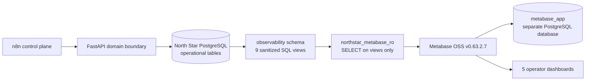

# Gate 6 Read-Only Metabase Observability

## Goals and boundary

Gate 6 makes expense operations, HITL SLA, outbox reliability, governed context,
provenance structure, and risk activity understandable without adding financial
decision behavior. Metabase is optional and read-only: stopping it has zero
effect on FastAPI, n8n, or PostgreSQL writes.

Metabase cannot call decision APIs, approve expenses, replay events, alter
policies, or write North Star tables. North Star Alembic never migrates
`metabase_app`; Metabase owns that database's internal schema.

## Observability schema and views

Alembic revision `20260813_0006` creates PostgreSQL schema `observability` from
separate SQL files and is a no-op on SQLite. The verified migration cycle was
`0005 -> 0006 -> 0005 -> 0006`, with operational data preserved.

| View | Operator purpose |
|---|---|
| `expense_operations` | volume, status, risk, processing duration, review and final outcome |
| `approval_sla` | pending work, age, remaining time, overdue state and Gate 3A stage |
| `reliability_outbox` | queue state, retries, leases, age, terminal failure and replay |
| `delivery_attempts` | per-attempt outcome, worker, safe error category and duration |
| `workflow_failures` | unresolved workflow/node/category incident health |
| `context_policy_health` | current policy version, ownership, certification, review and trust |
| `context_term_health` | governed business-term ownership, freshness and trust |
| `decision_provenance_quality` | one row per decision with evidence counts and structural completeness |
| `risk_signal_activity` | risk-signal evaluation frequency and triggered outcomes |

All age and overdue calculations use PostgreSQL `CURRENT_TIMESTAMP` and UTC
timestamps. Metabase display timezone is separately set to UTC in the Gate 6
runtime.

### Semantic reuse

The SLA view reproduces Gate 3A's existing ratios: reminder at 50%, overdue at
100%, escalation at 150%, and completed tasks reported as completed. Context
health follows Gate 4A precedence: applicable signal failure is `CONFLICTED`;
review or freshness expiry is `STALE`; missing certification/active ownership,
missing required signals, non-PASS signals, or other expiry is `UNVERIFIED`;
otherwise it is `TRUSTED`. Tests exercise TRUSTED, STALE, and UNVERIFIED cases.

`structurally_complete` requires policy, rule, trust, and risk evidence. It does
not claim deterministic provenance-hash verification; verification remains the
application service/API's responsibility.

## Security and privacy

The views deliberately exclude raw input and workflow payloads, complete
processing JSON, expense descriptions, payment details, decision comments,
human-evidence comments/identity, capability URLs, delivery keys, provider
responses, safe/raw error messages, authorization data, DSNs, credentials,
source references, and verbose evidence JSON. The schema contract test rejects
the sensitive column names.

`scripts/create_metabase_readonly_role.py` idempotently creates or reconciles a
LOGIN principal, revokes public-schema/table/sequence access, grants only
`USAGE` on `observability`, and grants only `SELECT` on its views. Using the
exact configured credentials, runtime validation proved:

- view SELECT: allowed;
- direct base-table SELECT: denied;
- INSERT, UPDATE, DELETE, TRUNCATE, CREATE, and ALTER: denied.

Passwords, the Metabase administrator credential, and sessions remain in
environment variables; `.env.example` contains placeholders only.

## Source-controlled content and compatibility

`metabase/manifest.json` defines stable logical collection/question/dashboard
keys, SQL paths, visualization types, descriptions, and card positions. Numeric
instance IDs are discovered at runtime. `metabase/validate.py` checks unique
keys, exact dashboard inventory, references, SQL usage, read-only queries,
supported displays, non-overlapping 24-column layouts, and credential patterns.

`metabase/client.py` centralizes status/body/timeout handling. `bootstrap.py`
owns the Metabase 0.63.2.7 REST compatibility boundary. Fresh setup uses the
runtime setup token, then reconciles the data source, collection, questions,
dashboards, and all card attachments. A second bootstrap preserves counts, and
a controlled description change updated the existing logical dashboard rather
than duplicating it.

The exact verified runtime is Metabase OSS `v0.63.2.7` (`30c5762`), official
image line `metabase/metabase:v0.63.2.x`, image digest
`sha256:095503d38b0048c1e7b499509d04ffb7b9999167872199a34bb7b73c5913fb9d`,
and official JAR SHA-256
`dc719b2dce60e0fae8d351dc0d44a59f0da696245f10bfb2882aa20c0506c858`.
Gate 9's derived runtime keeps that exact application image/JAR and replaces
only its published zero-length JDK tree with Temurin Java 21 from the official
`v0.61.2.x` image pinned at
`sha256:bd846162f7cdf81e8160917bdff6831733db129a1d38c9c9e872db93f90d489f`.
A Metabase or JDK upgrade must reverify setup, collection/card/dashboard
payloads, every query, idempotency, restart persistence, and permissions.

## Dashboard designs

Exactly five logical dashboards and 36 questions are bootstrapped:

| Dashboard | Cards | Design |
|---|---:|---|
| North Star \| Operations Overview | 8 | KPIs, status/risk bars, volume line, processing percentiles, attention table |
| North Star \| Approval & SLA | 7 | pending/overdue KPIs, role/risk/stage bars, reminders, oldest pending table |
| North Star \| Reliability & Recovery | 8 | pending/dead-letter KPIs, status/attempt/failure charts, retry and oldest-event tables |
| North Star \| Governed Context Health | 7 | policy/review KPIs, policy/term trust, owners, freshness, current-version table |
| North Star \| Decision Trace & Risk | 6 | decision/trigger KPIs, structural completeness, trust/signals, recent evidence table |

KPI cards occupy the top rows and detailed tables the bottom. Gate 6 does not
add brittle native-SQL dashboard parameter mappings: the committed version has
no global filters. Adding tested cross-card time/risk/policy filters is remaining
observability debt. Gate 5 evaluation remains file-based; no evaluation tables
or stale live KPI were introduced.

## Fixture and verification

`python -m scripts.seed_observability_demo` uses FastAPI/application services
for four expenses and human decisions, SLA notification reservation, workflow
failure capture, and outbox transitions. It includes LOW/CRITICAL,
pending/approved/rejected, overdue SLA, delivered/retry/dead-letter reliability,
TRUSTED/STALE/UNVERIFIED context, complete provenance, and triggered risk
signals. Only the isolated STALE/UNVERIFIED context demonstration rows are
written directly through SQLAlchemy as explicitly controlled non-decision test
fixtures; Gate 5 goldens are untouched.

Live verification executed every one of 36 questions through Metabase and
compared eleven headline result sets directly with PostgreSQL, including the
approval backlog and open workflow-failure count. Dashboard card
counts were `8/7/8/7/6`. Fresh instance A, idempotent rerun, a controlled
update, fresh instance B, and restart persistence all passed. With Metabase
stopped, the FastAPI PostgreSQL processing/explanation/persistence test passed.

Actual visual inspection was not performed because both available UI-control
runtimes failed before session initialization with a missing local kernel asset
path. Structural layout, attachment, query, and result verification passed; a
human browser pass remains release-demo preparation debt.

## Limitations and future deployment

- Gate 6 is PostgreSQL-only; normal SQLite application behavior remains intact.
- Views calculate live ages and trust against database time; they are not
  materialized and need no cache at current scale.
- No dashboard write actions or North Star RBAC were added.
- No full-project Compose, cloud deployment, CI publishing, or evaluation-run
  history was introduced; those belong to later gates.
- Production deployment needs secret management, TLS, backup/restore for both
  databases, Metabase authentication hardening, and an operator access model.
